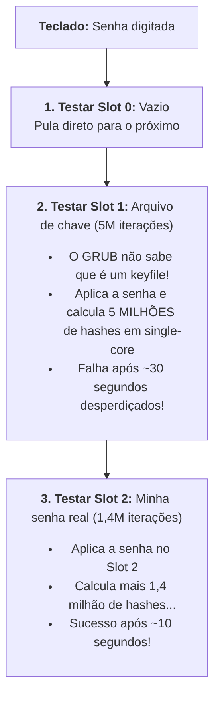

# Skill: Posts do Blog vndmtrx.github.io

Diretrizes para escrita, estruturação e formatação de posts para o blog pessoal de Eduardo (vndmtrx.github.io).

---

## 1. Voz, Tom e Identidade

O blog é pessoal e técnico (infraestrutura, segurança, DevOps, programação, open source e sociedade).

- **Pessoa e Registro:** 1ª pessoa para experiências/opiniões ("eu uso", "o que eu faço é"); 2ª pessoa informal para o público ("você", "vocês" — nunca "o leitor/usuário"); informalidade natural ("vcs", "pra", "pro", "tá", "né") quando o momento pede.
- **Posicionamento Firme:** Defenda posições com argumentos técnicos e claros. Não apresente opções neutras sem emitir opinião ou apontar a recomendação ideal.
- **Humor e Honestidade:** Humor situacional e pontual (sem exageros forçados). Honestidade aberta sobre complexidade, extensão do post ou limitações.

---

## 2. Fluxo Colaborativo de Escrita (Loop Contínuo e Proatividade)

O autor (Eduardo) é a autoridade máxima e definidora de tom, ideias e posicionamentos ("o deus do texto"). A escrita funciona em **ciclo iterativo contínuo**:

1. **Briefing e Ideação:** O autor resenha as ideias brutas, motivações e pontos centrais.
2. **Proatividade em Perguntas Focadas:** Havendo dúvida sobre **posicionamento, causos reais de bastidor, decisões conceituais ou escolhas de arquitetura**, a IA deve elencar perguntas pontuais para o autor calibrar a rota. *Não paralise o fluxo com perguntas triviais de sintaxe/código — rascunhe diretamente e deixe o autor ajustar no loop.*
3. **Construção em Loop:** A escrita evolui em iterações curtas (seção por seção ou blocos temáticos), recebendo feedback e ajustes contínuos do autor.
4. **Polimento Final:** Validação de invariantes, ritmo e checklist.

---

## 3. Invariantes Rígidas de Formatação (Hard Constraints)

Estas regras são **absolutas** para manter a identidade visual e tipográfica do blog:

1. **Títulos Limpos:** NUNCA use backticks, links, código inline ou notas de rodapé/citações (`[^n]`) em cabeçalhos (`##`, `###`, `####`). Escreva cabeçalhos em texto 100% puro (ex: `## O truque elegante: override_homedir`). Citações e referências bibliográficas devem ficar exclusivamente no texto corrido dos parágrafos da seção.
2. **Sem Divisores (`---`):** NUNCA insira linhas horizontais (`---`) no corpo do post, entre seções `##` ou antes de `## Referências`. O tema Minima cuida do espaçamento visual. Delimitadores `---` são de uso exclusivo do front matter YAML no topo do arquivo.
3. **Sem Travessão Longo (—):** NUNCA use travessão longo no texto. Use vírgulas, dois-pontos ou quebre em frases menores.
4. **Símbolos e Setas no Texto Corrido:** NUNCA use setas Unicode (`→`, `←`, `⇒`, `↔`) soltas no texto corrido em prosa. Use sempre representações ASCII (`->`, `<-`, `=>`, `<->`). Para diagramas, caixas e árvores em blocos de código (`code fences`), o padrão é o uso obrigatório de **Block Constructions / Box-Drawing** (veja a Seção 6).
5. **Emojis Apenas em Callouts:** NUNCA insira emojis soltos no texto corrido. Emojis são permitidos exclusivamente dentro de callouts/blockquotes.
6. **Sem H1 no Corpo:** O `#` é exclusivo do título no front matter. No corpo, comece em `##`.
7. **Callouts sem Footnotes ou Referências Externas:** NUNCA use notas de rodapé (`[^n]`) ou referências de links indiretas (`[texto][ref]`) dentro de caixas de callout (`> [!TIPO]`). O plugin `jekyll-gfm-admonitions` compila o bloco isoladamente via `@markdown.convert`, fazendo com que definições externas não sejam resolvidas e apareçam como texto literal puro (`[^n]`). Em callouts, use apenas links diretos inline (`[texto](url)`). Marcações autossuficientes (**negrito**, *itálico*, `código`, listas e blocos de código) funcionam normalmente.
8. **Primeiro Parágrafo sem Footnotes (Excerpt da Home Limpo):** NUNCA insira notas de rodapé (`[^n]`) no primeiro parágrafo do post (o parágrafo de abertura logo após o front matter). O Jekyll/Minima utiliza o primeiro parágrafo como *excerpt* (resumo automático) na listagem da página inicial (`home`). Inserir footnotes no primeiro parágrafo faz com que marcadores soltos apareçam na *home* sem a respectiva resolução. Deixe o primeiro parágrafo 100% livre de notas de rodapé; introduza notas `[^n]` apenas a partir do segundo parágrafo ou no corpo das seções.
9. **Links Internos via `post-ref.html`:** NUNCA use links internos hardcoded com URLs diretas (como `[Texto](/posts/slug/)` ou caminhos absolutos). Sempre use o include `` (ou omitindo `text` para adotar o título oficial do post). Esse include resolve a URL dinamicamente via `relative_url` respeitando qualquer ambiente (`baseurl`) e trata posts futuros ou agendados automaticamente, renderizando `<strong>Texto</strong> <em>(em breve)</em>` até a data em que o post for efetivamente publicado. Para links com âncoras de seção, use o parâmetro `anchor="nome-da-ancora"`.
10. **Proteção de Código Conflitante com Liquid (`raw` pontual):** O Jekyll processa o Markdown utilizando a engine Liquid. Qualquer trecho de código que contenha chaves duplas (`{{ ... }}` ou ``) — como playbooks do Ansible, templates Jinja2, Helm charts, Vue ou Angular — entrará em conflito direto com o Liquid, resultando em variáveis sendo apagadas em silêncio (virando strings vazias) ou em quebra do build com warnings/erros de sintaxe. NUNCA envolva o post inteiro em raw. Envolva **estritamente o bloco de código específico ou a expressão inline afetada** com `` e ``.
11. **Diagramas Mermaid via Front Matter (`mermaid: true`):** Quando utilizar blocos de diagramas Mermaid (` ```mermaid `), adicione **obrigatoriamente** `mermaid: true` no front matter do post. O carregamento do JavaScript (Mermaid v12) é condicional para preservar a performance e tempo de carregamento dos demais posts.

---

## 4. Estrutura dos Posts

### Front Matter Padrão

Todo post deve **obrigatoriamente** conter um `subtitle` atuando como uma frase de efeito ou *tagline* marcante (provocativa, bem-humorada ou descritiva de impacto):

```yaml
---
layout: post
title: "Título do Post"
subtitle: "Frase de efeito ou tagline marcante que sintetiza o post"
author:
  - "Eduardo N. S. R."
date: YYYY-MM-DD HH:MM:SS GMT-3
permalink: /posts/slug-do-post/
tags: [Tag1, Tag2]
# Opcionais:
series: Nome da Série
modified_date: YYYY-MM-DD HH:MM:SS GMT-3
---
```

### Macroestrutura Narrativa

- **Abertura (antes do primeiro `##`):** 2 a 5 parágrafos situando o leitor no contexto e apresentando o problema ou provocação. Sem bullet points na abertura. Em séries, mencione o repositório/tag parceiro.
- **Arco da Seção `##`:** Problema/Porquê -> Explicação técnica/Analogia -> Código/Exemplo -> Conexão com o próximo passo.
- **Transições:** Conecte o final de cada seção com a seguinte de forma orgânica.
- **Fechamento:** Recapitulação sem repetição mecânica, agregando reflexão, conexão com o futuro ou frase de efeito.

---

## 5. Ritmo, Cadência e Dinâmica Fractal (Anti-Uniformidade)

Evite a "cadência de IA" (blocos monótonos de 3 a 5 frases). A escrita deve respirar através de princípios fractais, Fibonacci e variação psicofisiológica (use as métricas como **bússola de ritmo intuitivo**, e não como contabilidade matemática rígida):

### Auto-Similaridade Fractal
Replique o ciclo **Provocação -> Desenvolvimento -> Arremate** nas 4 escalas:
- **Macro (Post):** Abertura instigante -> Arcos técnicos -> Conclusão com gancho.
- **Meso (Seção `##`):** Problema -> Dissecção técnica -> Transição.
- **Micro (Parágrafo):** Tese -> Sustentação/Nuance -> Fechamento.
- **Nano (Frase):** Oração de impacto -> Subordinada -> Ponto final seco.

### Densidade de Parágrafos (Fibonacci & Power Series / Lei de Potência)
Alterne o número de frases por parágrafo conforme o papel cognitivo:
- **1 frase (Monoverso):** Impacto, provocação, quebra de expectativa ou conclusão seca.
- **2 frases (Díade):** Causa + efeito direto, setup + payoff ou transição ágil.
- **3 frases (Tríade):** Padrão argumentativo (tese -> evidência -> desfecho).
- **5 frases (Pentágono):** Aprofundamento técnico e trade-offs detalhados.
- **8 frases (Narrativa):** Fluxo histórico ou passos encadeados (raro).

- **Curva de Decaimento para Posts Técnicos (Power Series Calibrada):**
  * **~50% a 55% (Motor Central):** Blocos médios de sustentação (3 a 4 frases) para construir argumentos técnicos e explicações completas.
  * **~30% a 35% (Ganchos e Respiros):** Blocos curtos e ágeis (1 a 2 frases) para monoversos de impacto, transições e alívios.
  * **~15% (Mergulhos Analíticos):** Blocos densos (5 a 8 frases) para contextos complexos, arquitetura e edge cases.
- **Regra:** Evite 3 parágrafos seguidos com o mesmo número de frases.

### Fisiologia da Leitura (Sístole vs. Diástole)
- **Sístole ("Prendendo o ar"):** Parágrafos densos acumulam pressão e atenção cognitiva.
- **Diástole ("Soltando o ar"):** OBRIGATÓRIO inserir um respiro (monoverso ou díade leve) após picos de tensão. Evite asfixiar o leitor com múltiplos blocos longos sem intervalo.
- **Compensação Micro/Macro:** Parágrafos densos pedem frases internas curtas (*staccato*); monoversos suportam frases mais densas ou aforísticas.

### Burstiness das Frases (Staccato vs. Legato)
- **Staccato (3 a 7 palavras):** Frases percussivas e diretas para impacto e ritmo.
- **Legato (20 a 35 palavras):** Períodos elaborados para encadeamento técnico.
- **Regra:** Nunca encadeie 3 frases consecutivas com extensão similar.

### Ruído Rosa ($1/f$) e Clusters Conceituais
- **Variação Orgânica:** A cadência não é um metrônomo repetitivo (`1,2,3,5...`), mas uma resposta dinâmica ao fluxo das ideias.
- **Clusters Analíticos:** É PERMITIDO encadear blocos longos consecutivos quando a complexidade de uma ideia exigir análise conceitual aprofundada (o tamanho é calibrado pelo peso intrínseco da ideia). Compense com blocos leves na sequência.

---

## 6. Elementos de Formatação e Sintaxe

| Elemento | Padrão e Sintaxe | Regra de Uso |
| :--- | :--- | :--- |
| **Bloco de Código** | Fence com linguagem + explicação em itálico logo abaixo | ```` ```bash\nssh ...\n```\n*Explicação do comando em itálico.* ```` (em tutoriais interativos com `$`, comentários inline `#` substituem o itálico). |
| **Código Inline** | \`comando\`, \`flag\`, \`caminho\`, \`função\` | Obrigatório para qualquer menção de código no texto corrido. *Nunca em títulos.* |
| **Estrangeirismos** | *termo em inglês* | Itálico para termos técnicos não traduzidos (*slop*, *page cache*, *dirty*, *runtime*). |
| **Callouts / Alerts** | `> [!TIPO] Título em Português`<br>`> Texto da nota` | Máximo 1 por seção. Sempre no padrão **GFM Admonitions** com **título explícito em português** (`> [!TIP] Dica`, `> [!NOTE] Nota`, `> [!NOTE] Disclaimer`, `> [!NOTE] Nota da Série`, `> [!WARNING] Aviso`, `> [!WARNING] Atenção`, `> [!IMPORTANT] Importante`, `> [!CAUTION] Aviso Crítico de Segurança`). Processado nativamente pelo plugin `jekyll-gfm-admonitions`. **Atenção:** o plugin compila o bloco de forma isolada — formatações locais funcionam perfeitamente (**negrito**, *itálico*, links diretos inline, código), mas **NUNCA** use notas de rodapé (`[^n]`) ou referências com definições fora da caixa, pois não são resolvidas e viram texto literal. |
| **Analogias** | Mundo físico e cotidiano | Usar quando o conceito for abstrato (ex: túnel SSH como cano de água com fio dentro; sudoers como chave mestra para entregador de pizza). |
| **Diagramas e Árvores (Block Construction)** | Textos monoespaçados com caracteres Box-Drawing | Usar **Block Constructions** Unicode (`├──`, `└──`, `│`, `┌──┐`, `└──┘`, `├──┤`, `──>`, `<──`, `───[túnel]──>`) para árvores de diretórios, topologias de rede, esquemas de frames e fluxogramas em fences de código. Evitar caracteres legados como `+--` e `|` soltos quando houver equivalentes limpos em box-drawing. |
| **Diagramas Mermaid** | Fence ```` ```mermaid ```` + `mermaid: true` no front matter | Para fluxogramas, grafos ou diagramas de sequência modernos e vetoriais (SVG). Exige obrigatoriamente a flag `mermaid: true` no front matter do post para carregamento condicional do script. |
| **Código Conflitante com Liquid (Jinja2/Ansible)** | Envolver com `` e `` pontuais | Obrigatório ao citar variáveis com duplas chaves (`{{ ... }}`) ou diretivas de template em blocos de código ou comandos inline, evitando que o Liquid do Jekyll tente interpretá-los. Nunca envolver o arquivo inteiro. |
| **Tabelas** | Markdown com alinhamento limpo | Para resumos comparativos e mapeamentos de flags. |
| **Footnotes** | `[^1]: **Título** {*Fonte*} ([Link](url))` | Referências externas no final, exclusivamente na seção `## Referências`. **Proibido no primeiro parágrafo** do post (para não poluir o *excerpt* na *home*) e proibido dentro de callouts. |
| **Exercícios** | `<details markdown="1">` com resposta | Apenas para tutoriais/séries. Obrigatoriamente na seção dedicada `## Exercícios`, enunciado visível, `<summary>Ver resposta</summary>` e atributo `markdown="1"`. Veja detalhes abaixo. |
| **Atualizações** | `**Atualização (DD/MM/AAAA):** Texto` | Para notas inseridas pós-publicação. |

### Padrão Estrutural de Exercícios (Tutoriais e Séries)

Para manter a consistência didática em todas as séries e tutoriais práticos do blog, a montagem de exercícios segue regras estritas de layout e visibilidade:

1. **Seção Dedicada (`## Exercícios`):** Os exercícios nunca devem ficar espalhados soltos no meio dos tópicos conceituais. Eles são agrupados exclusivamente em uma seção dedicada `## Exercícios`, posicionada perto do final do post (logo antes da Conclusão / O Que Vem / Referências).
2. **Frase Introdutória:** A seção inicia com uma frase convidando o leitor a praticar (ex: *"Para fixar a dinâmica de X, Y e Z, execute os desafios práticos abaixo no seu terminal."*).
3. **Numeração por Post:** A numeração sempre reinicia em cada post (`**1. ...**`, `**2. ...**`, `**3. ...**`). NUNCA propague numeração contínua entre posts diferentes da mesma série.
4. **Título do Desafio em Negrito:** Use o formato `**N. Nome do Desafio**` diretamente no texto (nunca como cabeçalho `###` ou dentro do `<summary>`).
5. **Enunciado Sempre Visível:** O contexto do problema, as instruções do desafio e os comandos iniciais ficam **100% visíveis no corpo do post**. O leitor deve conseguir ler e tentar resolver o exercício sem precisar clicar em nada.
6. **Resposta Oculta com `<summary>Ver resposta</summary>`:** Apenas a resposta, código de solução e explicações analíticas ficam recolhidos dentro de `<details markdown="1">`. O texto do `<summary>` deve ser rigorosamente padronizado como `<summary>Ver resposta</summary>`. NUNCA coloque títulos ou o enunciado dentro do `<summary>`.
7. **Atributo `markdown="1"` Obrigatório:** A tag de abertura deve ser estritamente `<details markdown="1">` para que blocos de código (`code fences`), realce de sintaxe e formatações Markdown sejam renderizados corretamente pelo motor kramdown do Jekyll.

#### Exemplo Canônico de Exercício:

````markdown
## Exercícios

Para fixar a dinâmica de [tópico], execute os desafios abaixo no terminal.

**1. Título do primeiro desafio**

Contexto do problema e instruções claras do que o leitor deve fazer ou testar no terminal ou no código.

<details markdown="1">
<summary>Ver resposta</summary>

Explicação detalhada da solução:

```bash
$ comando-da-solucao
```

*Nota ou reflexão técnica sobre a mecânica da resposta.*

</details>

**2. Título do segundo desafio**

Instruções do segundo desafio...

<details markdown="1">
<summary>Ver resposta</summary>

Solução e análise do segundo desafio...

</details>
````

### Padrão de Engenharia para Diagramas Mermaid (Pragmatismo, Tipos e Anti-Overengenharia)

O Mermaid (v12) está integrado nativamente ao blog com renderização vetorial (SVG), suporte a Dark Mode e recálculo dinâmico. Contudo, **diagrama não é enfeite**: deve ser usado com estrito pragmatismo técnico para evitar poluição visual e "overengenharia" desnecessária.

#### 1. Critério de Decisão: Quando USAR vs. Quando NÃO USAR

* **NÃO use Mermaid para comparação de especificações:** Se o objetivo é comparar hardware, tabelas de benchmark, parâmetros ou opções de comandos, **use Tabelas Markdown nativas**. Uma tabela simples de 2 ou 3 colunas é infinitamente mais elegante, rápida de ler e natural que um grafo artificial.
* **NÃO use Mermaid para saídas de terminal ou árvores estáticas:** Saídas de comandos (`lsblk`, `tree`, logs, headers) pertencem a blocos de código com caracteres Unicode **Block Construction / Box-Drawing**.
* **USE Mermaid para dinâmica e lógica de fluxo:** O Mermaid brilha em processos que envolvem **decisão (if/else), sequência temporal de passos, algoritmos, pipelines de dados, máquinas de estados ou troca de mensagens entre atores**.
* **Regra da Decisão do Autor:** A IA pode propor uma representação em Mermaid além do óbvio caso julgue que a visualização gráfica agregará valor didático ou estético superior à alternativa em texto/tabela, mas **deve apresentar a proposta para o autor (Eduardo) bater o martelo final**.

#### 2. Tipos de Diagramas e seus Usos Reais

Qualquer diagrama suportado pelo Mermaid pode ser utilizado, desde que sua proposta case com o problema técnico abordado:

* **`flowchart TD / LR` (Fluxogramas):** Decisões algorítmicas, pipelines de CI/CD, esteiras de compilação, árvores de decisão e sequenciamento de passos.
* **`sequenceDiagram` (Diagramas de Sequência):** Protocolos de rede, trocas de mensagens (SSH, HTTP/REST, gRPC, OAuth), handshakes criptográficos e chamadas entre microsserviços.
* **`stateDiagram-v2` (Máquinas de Estado):** Ciclos de vida de conexões, estados de processos no kernel, transições de tarefas ou máquinas de estado em código.
* **`gantt` (Gráficos de Gantt/Tempo):** Paralelismo de I/O, tempos concorrentes de inicialização de serviços ou fases temporais.
* **`gitGraph` (Grafos Git):** Estratégias de ramificação, rebase, cherry-pick, conflitos e merge.

#### 3. Invariantes Rígidas de Estilo para Diagramas

Para manter a sobriedade e a identidade do blog nos diagramas:

1. **Front Matter Obrigatório:** Sempre adicionar `mermaid: true` no front matter do post para que o bundle JS seja baixado condicionalmente.
2. **Zero Emojis:** NUNCA use emojis dentro dos nós do diagrama. Mantenha o padrão técnico e limpo do blog.
3. **Setas em Texto Puro:** Use setas no padrão ASCII (`-->` ou `==>`), nunca setas tipográficas (`──>`).
4. **Sem Caixas Aninhadas Falsas (Anti-Subgraph Unitário):** NUNCA envolva um único nó dentro de um `subgraph` apenas para colocar um título externo. Isso cria o visual feio de "caixa dentro de outra caixa" (borda dupla). Use `subgraph` exclusivamente para agrupar 2 ou mais nós que pertencem a um mesmo subsistema/módulo real.
5. **Estrutura dos Cards (Flowcharts):**
   * **Título em Negrito:** Primeira linha do nó com `<b>N. Título da Etapa</b>`.
   * **Listas HTML `<ul><li>`:** Use elementos de lista para múltiplos itens ou descrições, garantindo alinhamento à esquerda perfeito e recuo proporcional (*hanging indent*) mesmo em telas de celular.
   * **Alinhamento:** Textos dos cards detalhados alinhados à esquerda; nós acionadores ou badges de topo (como o `KEY`) centralizados.
6. **Classes Semânticas de Cores:** Atribua classes semânticas aos nós para harmonização com os temas claro (`classic`) e escuro (`dark`):
   * `class ID key;`: Para badges de entrada, acionadores ou seletores (neutro escuro/ardósia, centralizado).
   * `class ID neutral;`: Para etapas informativas padrão ou neutras.
   * `class ID failure;`: Para caminhos de falha, erros, desvios indesejados, lentidão ou descarte (borda e fundo em alerta avermelhado sutil).
   * `class ID success;`: Para caminhos felizes, conclusões bem-sucedidas ou etapas otimizadas (borda e fundo em tom esmeralda suave).

#### Exemplo Canônico de Flowchart Estilizado:

````markdown

````

---

## 7. Padrões de Autoria e Estilo de Eduardo (Voz Autêntica)

Incorpore as marcas registradas do autor como **tempero dosado** (1 a 2 por post, sem saturar). Em caso de dúvida sobre onde cabe um alívio textual ou piada, pergunte ao autor:

- **Marcadores de Transição:** *"Pois bem. Cá estamos."*, *"Agora vamos ao que interessa"*, *"Hora de sujar as mãos"*, *"A cereja no topo do bolo"*, *"A pergunta de um milhão de reais"*.
- **Diálogo e Auto-Interrupção:** Pingue-pongue retórico (*"Parece críptico? Parece. E é proposital."*) e quebra de 4ª parede (*"Mas antes: o que diabos é X, Dudu?"*, *"Lembra daquela vez em que..."*).
- **Alívio Cômico e Desabafos de TI:** Apartes em parênteses `(por favor não faça isso)`, `(atenção para esse fato)`, `(Luxo.)`; piadas com a dor real de infra (*"servidores LDAP adoram cair na sexta às 18h"*, *"reconsidere suas escolhas de vida se usa nslcd"*); expressões genuínas (*"mds, quanto tempo perdi sem isso"*, *"Aham Cláudia, senta lá!"*, *"vozes na minha cabeça"* em disclaimers).
- **Analogias Viscerais:** Encanamentos, porteiros biométricos, entregadores de pizza, adubo, solo e podas de jardim.
- **Monomorfismos de Impacto:** Frases secas afirmativas em sequência para cravar teses (*"Você não constrói pontes. Você planta jardins."*).

---

## 8. Antipadrões de IA a Evitar

- **Aberturas Clichês:** Evite "Neste post vamos explorar...", "Neste artigo abordaremos...". Comece com uma provocação real ou situação prática.
- **Bordões e Transições Artificiais:** Evite "É importante notar que...", "Vale ressaltar que...", "Dito isso...", "Com isso em mente...".
- **Adjetivação Pomposa e Jargões de IA (Proibido):** NUNCA use termos afetados ou pseudo-sofisticados típicos de IA. Exemplos proibidos: *"cirúrgico"*, *"magistral"*, *"impecável"*, *"eloquente"*, *"lapidar"*, *"arquitetura de elite"*, *"deveras"*, *"sublime"*, ou o uso excessivo e vazio de *"robusto"*.
- **Aliterações e Exageros Dramáticos:** Evite figuras de linguagem teatrais, aliterações forçadas ou tom épico/presunçoso. O autor tem voz direta, técnica, pé no chão e com humor autêntico de quem vive nos bastidores de infra/DevOps.
- **Ecos e Reciclagem Textual (Proibido):** NUNCA repita expressões idênticas, metáforas gêmeas, construções frasais espelhadas ou bordões em diferentes partes do post (ex: repetir *"décadas de disputa"*, *"prints com letras garrafais"*, *"guerra fiscal"* ou fórmulas similares em seções próximas ou distantes). Faça uma varredura atenta para garantir vocabulário fresco e formulações únicas para cada argumento.
- **Listas Preguiçosas:** Não use bullet points como substituto de argumentação ou narrativa em prosa.
- **Títulos Genéricos:** Evite "Visão Geral", "Entendendo o Conceito", "Melhores Práticas". Use títulos temáticos específicos.
- **Conclusões Chapa-Branca:** Evite conclusões que apenas resumem o que já foi lido sem agregar uma reflexão ou provocação.
- **Código sem Contexto:** Nunca solte código sem explicar o problema antes e o resultado depois.

---

## 9. Checklist Final de Validação

Antes de publicar ou entregar qualquer post, valide:

- [ ] Invariantes respeitadas (sem backtick em títulos, sem `---` entre seções, sem travessão `—`, sem setas Unicode, sem emoji solto)?
- [ ] Vocabulário limpo e autêntico (zero jargões pomposos como "cirúrgico", sem exageros narrativos ou tom épico de IA)?
- [ ] Verificação de ecos e repetições (zero reciclagem de frases, metáforas idênticas ou fórmulas espelhadas ao longo do texto)?
- [ ] Ritmo e cadência dinâmicos (auto-similaridade fractal, Fibonacci, alternância sístole/diástole)?
- [ ] Variação de tamanho de frases (*burstiness* / staccato vs. legato)?
- [ ] Front matter completo e correto (author em lista YAML, layout, tags)?
- [ ] Subtítulo marcante no front matter (`subtitle: "..."`) atuando como frase de efeito/tagline?
- [ ] Códigos com linguagem no fence e explicação em itálico (ou comentários inline)?
- [ ] Comandos, flags e arquivos com backticks no texto corrido?
- [ ] Termos em inglês e estrangeirismos em *itálico*?
- [ ] Callouts no padrão GFM Admonitions (`> [!TIPO] Título`) sem notas de rodapé ou referências externas (apenas links inline diretos)?
- [ ] Diagramas, fluxos e árvores usando Block Constructions / Box-Drawing (`├──`, `└──`, `│`, `┌──┐`, `└──┘`, `──>`)?
- [ ] Referências com footnote `[^n]` na seção `## Referências`?
- [ ] Primeiro parágrafo de abertura 100% livre de footnotes `[^n]` (sem quebrar o *excerpt* da *home*)?
- [ ] Links internos para outros posts do blog usando exclusivamente o include `` (zero links hardcoded `/posts/...`)?
- [ ] Sintaxes com chaves duplas `{{ ... }}` (Ansible, Jinja2, Helm) protegidas pontualmente com ` ... ` para não conflitar com o Liquid do Jekyll?
- [ ] Se o post utilizar diagramas Mermaid (` ```mermaid `), a flag `mermaid: true` está presente no front matter?
- [ ] Diagramas Mermaid respeitam as diretrizes de engenharia (sem emojis, setas ASCII `-->`, nós em lista `<ul><li>`, classes semânticas e zero caixas aninhadas)?
- [ ] Para séries/tutoriais: seção dedicada `## Exercícios` no final do post, com enunciados visíveis, numeração reiniciada (1..N) e respostas recolhidas em `<details markdown="1"><summary>Ver resposta</summary>`?
