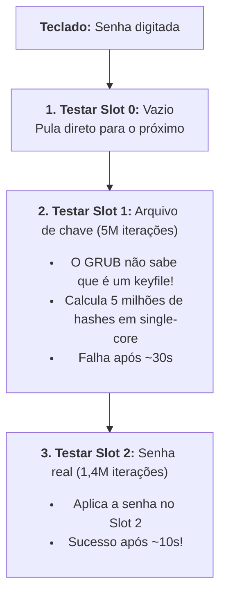

# Referência Avançada: Formatação, Diagramas e Exercícios

Este documento serve como referência sob demanda para a skill `blog-posts` do blog `vndmtrx.github.io`. Consulte este arquivo apenas quando o post exigir diagramas Mermaid complexos, árvores/túneis em Box-Drawing ou blocos de exercícios interativos.

---

## 1. Padrão Estrutural de Exercícios (Tutoriais e Séries)

Para manter a consistência didática em todas as séries e tutoriais práticos do blog, a montagem de exercícios segue regras estritas:

1. **Seção Dedicada (`## Exercícios`):** Agrupados exclusivamente em uma seção `## Exercícios` no final do post (antes da Conclusão / Referências).
2. **Frase Introdutória:** Convidar o leitor a praticar (*"Para fixar a dinâmica de X, execute os desafios abaixo no seu terminal."*).
3. **Numeração por Post:** Reinicia em cada post (`**1. ...**`, `**2. ...**`). Nunca propagar numeração contínua entre posts diferentes.
4. **Título do Desafio em Negrito:** Use `**N. Nome do Desafio**` diretamente no texto (nunca como cabeçalho `###` ou dentro do `<summary>`).
5. **Enunciado Sempre Visível:** Contexto, instruções e comandos iniciais ficam 100% visíveis no corpo do post.
6. **Resposta Oculta com `<summary>Ver resposta</summary>`:** Apenas a resposta, código e explicações analíticas ficam recolhidos dentro de `<details markdown="1">`.
7. **Atributo `markdown="1"` Obrigatório:** A tag de abertura deve ser `<details markdown="1">` para que code fences e Markdown sejam renderizados corretamente pelo kramdown.

### Exemplo Canônico de Exercício:

````markdown
## Exercícios

Para fixar a dinâmica do post, execute os desafios abaixo no terminal.

**1. Título do primeiro desafio**

Contexto do problema e instruções claras do que testar.

<details markdown="1">
<summary>Ver resposta</summary>

Explicação detalhada da solução:

```bash
$ comando-da-solucao
```

*Nota ou reflexão técnica sobre a mecânica da resposta.*

</details>
````

---

## 2. Diagramas Mermaid (Pragmatismo, Tipos e Invariantes)

O Mermaid (v12) está integrado nativamente com renderização vetorial (SVG) e suporte a Dark Mode.

### Invariantes Rígidas de Estilo:
1. **Front Matter Obrigatório:** Sempre adicionar `mermaid: true` no front matter do post.
2. **Zero Emojis:** NUNCA use emojis dentro dos nós do diagrama.
3. **Setas em ASCII Puro:** Use setas no padrão ASCII (`-->` ou `==>`), nunca setas tipográficas (`──>`).
4. **Sem Caixas Aninhadas Falsas:** NUNCA envolva um único nó dentro de um `subgraph` apenas para colocar título externo. Use `subgraph` exclusivamente para agrupar 2 ou mais nós de um mesmo subsistema.
5. **Estrutura dos Cards (Flowcharts):**
   * Título em negrito: Primeira linha com `<b>N. Título da Etapa</b>`.
   * Listas HTML `<ul><li>`: Para múltiplos itens/descrições com alinhamento à esquerda perfeito.
6. **Classes Semânticas de Cores:**
   * `class ID key;`: Badges de entrada, acionadores ou seletores.
   * `class ID neutral;`: Etapas informativas padrão.
   * `class ID failure;`: Caminhos de falha, erros, lentidão ou descarte (tom avermelhado sutil).
   * `class ID success;`: Caminhos felizes ou conclusões bem-sucedidas (tom esmeralda suave).

### Exemplo Canônico de Flowchart Estilizado:

````markdown

````

---

## 3. Diagramas em Texto Monoespaçado (Block Construction / Box-Drawing)

Para árvores de diretórios, saídas de terminal, topologias de rede simples e esquemas de frames dentro de blocos de código (`code fences`), use caracteres Box-Drawing:

```
├── pasta/
│   ├── subpasta/
│   └── arquivo.txt
└── configuracao.yml

┌─────────────────┐       ┌─────────────────┐
│  Cliente Local  │ ───>  │  Proxy / Bastion│ ───> Servidor Interno
└─────────────────┘       └─────────────────┘
```
Evite caracteres legados como `+--` ou `|` soltos quando houver equivalentes limpos em Box-Drawing.
