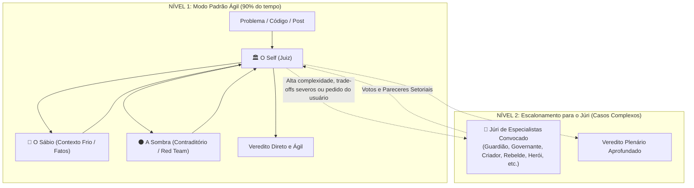

# Skill: Debate Dialético e Tribunal Técnico dos Arquétipos

Esta skill implementa o modelo de deliberação e tomada de decisão em dois níveis de profundidade: o **Modo Padrão Ágil (A Tríade Central)** e o **Modo Tribunal Pleno (Escalonamento para o Júri sob Demanda)**.

---

## 1. Os Dois Modos de Operação

---

## 2. Nível 1: A Tríade Central (Modo Padrão)

Para a grande maioria das revisões de texto, scripts, pequenos refactors e dúvidas de arquitetura, o sistema opera **exclusivamente com a Tríade**:

1. 🦉 **O Sábio (Contexto Frio):** Extrai dados puros, logs, código literal e restrições reais.
2. 🌑 **A Sombra (O Contraditório):** Aponta os pontos fracos, piores cenários e premissas frágeis.
3. 🏛️ **O Self / Juiz (Árbitro):** Avalia as evidências do Sábio, pondera os ataques da Sombra e emite o Veredito Oficial com o plano de ação.

---

## 3. Nível 2: Escalonamento para o Júri Arquetípico

O Júri de Especialistas entra em cena apenas quando a complexidade do caso exigir perspectivas ou lentes analíticas adicionais.

### Mecânica de Convocação do Júri:
1. **Autonomia do Juiz:** O Juiz tem liberdade para avaliar o caso e convocar diretamente os jurados arquetípicos mais adequados ao contexto.
2. **Consulta Colaborativa:** O Juiz pode apontar nuances que demandam atenção e sugerir a entrada de jurados ao usuário.
3. **Comando do Usuário:** O usuário pode a qualquer momento solicitar a entrada de jurados específicos para enriquecer o debate.

---

## 4. O Panteão dos 14 Arquétipos Disponíveis

* **Membros Permanentes (A Tríade):**
  * 🦉 **O Sábio:** Contexto Frio, perícia e dados brutos.
  * 🌑 **A Sombra:** Contraditório, Red Team e piores cenários.
  * 🏛️ **O Self / Juiz:** Magistrado, integrador e decisor.
* **Membros Temporários de Especialidade (Convocados sob Demanda):**
  * 🛡️ **O Guardião:** Segurança defensiva, menor privilégio e DR.
  * ⚖️ **O Governante:** Governança, compliance, LGPD/ISO e contratos.
  * ✨ **O Criador:** Arquitetura de software, Clean Arch e modularidade.
  * 👤 **O Cidadão:** Acessibilidade e ergonomia para o usuário comum.
  * 💎 **O Amante:** Estética, acabamento e Developer Experience (DX).
  * 🃏 **O Bobo da Corte:** Chaos Engineering, testes absurdos e macacos no teclado.
  * ⚔️ **O Herói:** Performance extrema, baixa latência e SRE sob estresse.
  * ⚡ **O Rebelde:** Anti-overengineering, Navalha de Occam, KISS e FinOps.
  * 🔮 **O Mago:** Automações avançadas, IA e saltos de produtividade.
  * 🔭 **O Explorador:** R&D, benchmarks de mercado e inovação.
  * 🌱 **O Inocente:** Ética, transparência e ausência de dark patterns.

Consulte [references/personas-e-prompts.md](references/personas-e-prompts.md) para os prompts detalhados e a diretriz estrita de **Neutralidade e Anti-Sycophancy**.
