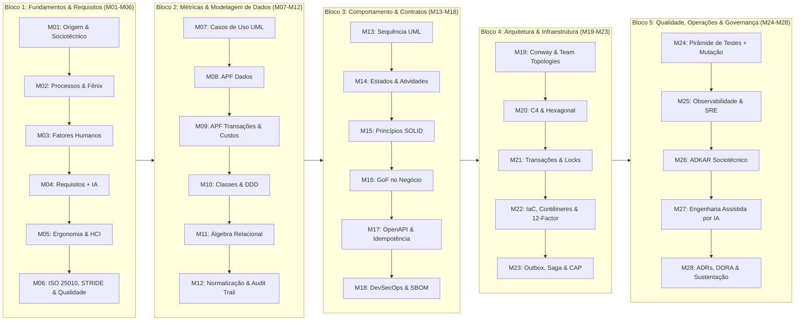

# Série: Engenharia de Software Essencial -- Da Demanda à Arquitetura (28 Módulos)

> **Aviso de Escopo:** Esta série condensa os fundamentos e a espinha dorsal da Engenharia de Software moderna, alinhada às Áreas de Conhecimento do **SWEBOK v4.0** (IEEE Computer Society). Ela serve como guia prático, referencial de campo e mapa mental de autoestudo, mas **não substitui** a profundidade de cursos extensivos, literatura clássica e anos de prática deliberada em projetos de grande porte.

---

## 🚘 O Projeto Piloto: Sistema de Gestão e Controle de Frotas (SGCF)

Para ancorar a teoria em um contexto de engenharia realista, utilizaremos um único sistema de negócio desenvolvido e documentado etapa por etapa ao longo de toda a série.

### 1. Contexto do Cliente e Problema de Negócio
Uma empresa de logística e serviços operacionais possui uma frota de 80 veículos compartilhados entre dezenas de motoristas e técnicos de campo. Atualmente, o controle é realizado por meio de pranchetas de papel e planilhas eletrônicas descentralizadas. Esse modelo manual gera:
* **Falta de Rastreabilidade**: Veículos são retirados sem registro formal de odômetro inicial/final ou identificação do condutor responsável no momento de infrações.
* **Perda de Comprovantes**: Notas fiscais de abastecimento em postos conveniados são extraviadas antes da prestação de contas, impossibilitando o cálculo real de custo por quilômetro (R$/km).
* **Conflito de Uso**: Motoristas disputam os mesmos veículos no pátio, gerando atrasos em atendimentos externos.
* **Dados Inconsistentes**: Registros manuais de quilometragem apresentam erros de digitação e ausência de conferência de localização geográfica.

### 2. Visão da Solução e Restrições Técnicas
O **SGCF** será uma solução orientada a **Mobile-First Web (PWA)** voltada para agilidade operacional na ponta, integrada a um painel de retaguarda para a gestão:
* **Check-in/Check-out Ágil por QR Code**: Cada veículo possui um QR Code físico colado no painel. O motorista aponta a câmera do celular no navegador, abre a tela do veículo específico e realiza a retirada em segundos.
* **Auditoria de Posição via Geolocation API**: O navegador captura de forma simplificada as coordenadas de GPS do dispositivo no momento do check-in, paradas intermediárias e encerramento para validação de presença física.
* **Prestação de Contas de Abastecimento**: Registro do volume de combustível, valor total, odômetro do momento e upload da foto da nota fiscal diretamente pelo celular.
* **Independência Tecnológica**: O projeto será modelado conceitualmente através de padrões de engenharia (UML, Álgebra Relacional, Normalização, OpenAPI, Modelo C4 e manifestos de infraestrutura), mantendo o núcleo agnóstico a linguagens ou bancos de dados específicos.

---

## 🗺️ Visão Panorâmica da Trilha de Publicação

---

## 📚 Bibliografia Fundamental da Série

* **Engenharia de Software, Processos & Governança Formal**:
  * *Guide to the Software Engineering Body of Knowledge (SWEBOK Guide v4.0)* -- IEEE Computer Society
  * *Software Engineering* -- Ian Sommerville
  * *Software Engineering: A Practitioner's Approach* -- Roger S. Pressman & Bruce R. Maxim
  * *The Mythical Man-Month: Essays on Software Engineering* -- Frederick P. Brooks Jr.
* **Fatores Humanos, Psicologia & Cultura de Fluxo**:
  * *The Psychology of Computer Programming* -- Gerald M. Weinberg
  * *The Phoenix Project: A Novel about IT, DevOps, and Helping Your Business Win* -- Gene Kim, Kevin Behr & George Spafford
  * *The Unicorn Project: A Novel about Developers, Digital Disruption, and Thriving in the Age of Data* -- Gene Kim
  * *The Design of Everyday Things* -- Don Norman
  * *Team Topologies: Organizing Business and Technology Teams for Fast Flow* -- Matthew Skelton & Manuel Pais
  * *ADKAR: A Model for Change in Business, Government, and Our Community* -- Jeffrey M. Hiatt (Prosci)
* **Métricas & Pontos de Função**:
  * *Function Point Analysis: Measurement Practices Manual* -- IFPUG
  * *Análise de Pontos de Função: Medição, Estimativas e Gerenciamento de Projetos de Software* -- Carlos Eduardo Vazquez, Guilherme Siqueira Simões e Renato F. Albert
* **Modelagem, UML & Orientação a Objetos**:
  * *UML Distilled: A Brief Guide to the Standard Object Modeling Language* -- Martin Fowler
  * *The Unified Modeling Language User Guide* -- Grady Booch, James Rumbaugh & Ivar Jacobson
  * *Applying UML and Patterns: An Introduction to Object-Oriented Analysis and Design* -- Craig Larman
  * *Domain-Driven Design: Tackling Complexity in the Heart of Software* -- Eric Evans
* **Teoria de Bancos de Dados & Álgebra Relacional**:
  * *Database System Concepts* -- Abraham Silberschatz, Henry F. Korth & S. Sudarshan
  * *Fundamentals of Database Systems* -- Ramez Elmasri & Shamkant B. Navathe
* **Design, Arquitetura & Sistemas Distribuídos**:
  * *Design Patterns: Elements of Reusable Object-Oriented Software* -- Erich Gamma, Richard Helm, Ralph Johnson & John Vlissides (GoF)
  * *Software Architecture in Practice* -- Len Bass, Paul Clements & Rick Kazman
  * *Fundamentals of Software Architecture: An Engineering Approach* -- Mark Richards & Neal Ford
  * *Designing Data-Intensive Applications* -- Martin Kleppmann
  * *Software Architecture for Developers (The C4 Model)* -- Simon Brown
* **Segurança, Operações & Qualidade**:
  * *Threat Modeling: Designing for Security* -- Adam Shostack
  * *Accelerate: The Science of Lean Software and DevOps* -- Nicole Forsgren, Jez Humble & Gene Kim
  * *Release It!: Design and Deploy Production-Ready Software* -- Michael T. Nygard
  * *Site Reliability Engineering: How Google Runs Production Systems* -- Niall Richard Murphy, Betsy Beyer et al.

---

## 🎯 Diretrizes de Redação & Execução

1. **Meta de Extensão e Calibração Estatística ($\mu \approx 4.800$ palavras, $\sigma \approx 700$ palavras)**:
   A extensão dos posts foi calibrada na interseção dos **Deep Dives Técnicos** (3.500 a 4.700 palavras) e dos **Mega Ensaios & Tutoriais Extensivos** (5.000 a 6.500 palavras) do blog, estabelecendo uma média alvo de **$\mu = 4.800$ palavras** por post ($\approx 135.000$ palavras no total da série). A variação é distribuída em 3 Tiers de densidade conceitual:
   * **Tier 1 -- Fundacional / Conceitual ($\mu - 1\sigma \approx 3.600$ a $4.200$ palavras)**: Módulos históricos, de processo, fatores humanos, psicologia ou diagramas de foco único.
   * **Tier 2 -- Padrão de Engenharia ($\mu \approx 4.500$ a $5.000$ palavras)**: O motor central da série, combinando teoria formal, estudo de caso do SGCF e diagramas estruturados.
   * **Tier 3 -- Deep Dive de Alta Densidade ($\mu + 1\sigma$ a $\mu + 2\sigma \approx 5.400$ a $6.500$ palavras)**: Módulos com grande carga teórica, múltiplas normas e taxonomias (ISO 25010 + STRIDE, Normalização 3NF + DER, C4 N1-N3 + Hexagonal, Integridade ACID + Locks, DevSecOps + SBOM, Outbox + Sagas).
2. **Diagramas as Code**: Todos os diagramas devem ser codificados em **Mermaid** ou **PlantUML** nativos, prontos para renderização no Jekyll/GitHub Pages.
3. **Didática Visual na APF (Módulos 8 e 9)**: Evitar o tom de manual burocrático; apresentar mockups conceituais de telas e vincular cada campo/tabela diretamente ao cálculo de R$/km.
4. **Pseudocódigo Estruturado no Design (Módulo 15)**: Usar pseudocódigo e diagramas "Antes vs Depois" para demonstrar a Inversão de Dependência (DIP) de forma agnóstica à sintaxe.
5. **Contextualização de Integração (Módulo 23)**: Explicar explicitamente que Transactional Outbox e Sagas são aplicados na fronteira do Monolito Modular com **serviços externos** (Gateway de SMS/WhatsApp e ERP corporativo).

---

## 📐 Matriz de Densidade e Extensão dos Módulos

| Módulo | Tema Central | Tier de Densidade | Meta de Extensão | Desvio ($\sigma$) |
| :---: | :--- | :---: | :---: | :---: |
| **M01** | Origem, Crise do Software e Sistema Sociotécnico | Tier 1 (Fundacional) | ~3.800 palavras | $-1.4\sigma$ |
| **M02** | Processos, Ciclos de Vida e O Projeto Fênix | Tier 1 (Fundacional) | ~4.200 palavras | $-0.9\sigma$ |
| **M03** | Fatores Humanos, Hawthorne e Elicitação Empática | Tier 1 (Fundacional) | ~4.000 palavras | $-1.1\sigma$ |
| **M04** | Engenharia de Requisitos, Mapeamento e Apoio por IA | Tier 2 (Padrão) | ~4.600 palavras | $-0.3\sigma$ |
| **M05** | Carga Cognitiva (Sweller), HCI e Ergonomia de Campo | Tier 2 (Padrão) | ~4.400 palavras | $-0.6\sigma$ |
| **M06** | Especificação ISO/IEC 25010, STRIDE e SRS Formal | Tier 3 (Alta Densidade) | ~5.800 palavras | $+1.4\sigma$ |
| **M07** | Delimitação de Escopo com Casos de Uso UML | Tier 1 (Fundacional) | ~3.800 palavras | $-1.4\sigma$ |
| **M08** | APF: Funções de Dados (ALI, AIE) e Telas | Tier 2 (Padrão) | ~4.800 palavras | $\mu$ |
| **M09** | APF: Transações (EE, SE, CE), Produtividade e Custos | Tier 2 (Padrão) | ~4.800 palavras | $\mu$ |
| **M10** | Classes de Domínio UML e DDD Estratégico | Tier 2 (Padrão) | ~5.000 palavras | $+0.3\sigma$ |
| **M11** | Fundamentos e Operadores de Álgebra Relacional | Tier 2 (Padrão) | ~4.600 palavras | $-0.3\sigma$ |
| **M12** | Teoria da Normalização (1NF a BCNF), DER e Audit Trail | Tier 3 (Alta Densidade) | ~6.000 palavras | $+1.7\sigma$ |
| **M13** | Modelagem Dinâmica: Diagrama de Sequência UML | Tier 1 (Fundacional) | ~4.000 palavras | $-1.1\sigma$ |
| **M14** | Máquina de Estados e Diagrama de Atividades | Tier 2 (Padrão) | ~4.600 palavras | $-0.3\sigma$ |
| **M15** | Princípios SOLID e Métricas de Acoplamento/Coesão | Tier 2 (Padrão) | ~4.800 palavras | $\mu$ |
| **M16** | Padrões GoF Aplicados ao Domínio de Negócio | Tier 2 (Padrão) | ~4.800 palavras | $\mu$ |
| **M17** | Design de Contratos OpenAPI 3.0 e Idempotência | Tier 2 (Padrão) | ~4.700 palavras | $-0.1\sigma$ |
| **M18** | DevSecOps, Modelagem SAST/DAST e SBOM CycloneDX | Tier 3 (Alta Densidade) | ~5.600 palavras | $+1.1\sigma$ |
| **M19** | Dinâmica Organizacional: Conway e Team Topologies | Tier 2 (Padrão) | ~4.400 palavras | $-0.6\sigma$ |
| **M20** | Modelo C4 (Níveis 1-3) e Monolito Modular Hexagonal | Tier 3 (Alta Densidade) | ~6.200 palavras | $+2.0\sigma$ |
| **M21** | Integridade ACID, Níveis de Isolamento e Locks | Tier 3 (Alta Densidade) | ~5.500 palavras | $+1.0\sigma$ |
| **M22** | IaC, 12-Factor App e Docker Compose Declarativo | Tier 2 (Padrão) | ~4.800 palavras | $\mu$ |
| **M23** | CAP/PACELC, Transactional Outbox e Padrão Saga | Tier 3 (Alta Densidade) | ~5.800 palavras | $+1.4\sigma$ |
| **M24** | Pirâmide de Testes, Test Doubles e Testes de Mutação | Tier 2 (Padrão) | ~4.800 palavras | $\mu$ |
| **M25** | Observabilidade Ativa, OpenTelemetry e Métricas SRE | Tier 2 (Padrão) | ~5.000 palavras | $+0.3\sigma$ |
| **M26** | Gestão de Mudança e Adoção Sociotécnica (ADKAR) | Tier 1 (Fundacional) | ~4.200 palavras | $-0.9\sigma$ |
| **M27** | Engenharia de Software Assistida por IA e Débito Técnico | Tier 2 (Padrão) | ~4.700 palavras | $-0.1\sigma$ |
| **M28** | Governança Técnica, ADRs, Métricas DORA e Sustentação | Tier 2 (Padrão) | ~5.000 palavras | $+0.3\sigma$ |

---

## Roteiro Detalhado de Produção

### Bloco 1: Fundamentos, Fatores Humanos e Requisitos

#### Módulo 1: A Natureza do Software e a Origem da Engenharia
* **Meta de Extensão**: ~3.800 palavras (Tier 1: Fundacional, $\mu - 1.4\sigma$)
* **Teoria & Fundamentos**: A Crise do Software (OTAN 1968); desenvolvimento artesanal vs método de engenharia; deterioração do software por complexidade acumulada (*Software Rot*); sistemas de software como sistemas sociotécnicos; introdução às KAs do SWEBOK v4.0.
* **Leituras Recomendadas**: Sommerville (Cap. 1); Brooks Jr. (*No Silver Bullet*); SWEBOK v4.0.
* **Exercícios de Fixação**: Identificação de gargalos estruturais e de processo em operações analógicas.
* **Entregável**: Ensaio crítico sobre os custos ocultos do "código sem projeto de engenharia".

---

#### Módulo 2: Modelos de Processo, Ciclos de Vida e Fluxo de Trabalho
* **Meta de Extensão**: ~4.200 palavras (Tier 1: Fundacional, $\mu - 0.9\sigma$)
* **Teoria & Fundamentos**: Modelo Cascata de Winston Royce; Modelos Iterativos e Incrementais (Espiral de Boehm); Filosofia Ágil e controle empírico de incerteza; quando usar abordagens preditivas vs adaptativas.
* **Casos Práticos (O que fazer / O que NÃO fazer)**: *O Projeto Fênix* -- os 4 Tipos de Trabalho (Projetos de Negócio, Projetos Internos de TI, Mudanças e Trabalho Não Planejado) e a canibalização da engenharia.
* **Leituras Recomendadas**: Pressman (Caps. 2 e 3); Sommerville (Cap. 2); *O Projeto Fênix* (Gene Kim et al.).
* **Estudo de Caso (SGCF)**: Avaliação do cenário corporativo do cliente e escolha do modelo híbrido de entrega para o sistema de frotas.
* **Exercícios de Fixação**: Análise de cenários de contratação pública e privada para seleção de ciclo de vida.
* **Entregável**: Matriz de decisão de ciclo de vida do projeto SGCF.

---

#### Módulo 3: Fatores Humanos -- Psicologia da Elicitação e Pedagogia da Conversa
* **Meta de Extensão**: ~4.000 palavras (Tier 1: Fundacional, $\mu - 1.1\sigma$)
* **Teoria & Fundamentos**: A psicologia aplicada ao cliente; o **Efeito Hawthorne** (mudança de comportamento por se sentir vigiado); Escuta Ativa e empatia com as "gambiarras" operacionais do usuário; a técnica socrática de perguntas abertas e os 5 Porquês; identificação de resistências políticas e medo de vigilância punitiva.
* **Casos Práticos (O que fazer / O que NÃO fazer)**: *O Projeto Fênix* -- a armadilha do "Brent" (o gargalo humano que centraliza regras na cabeça e bloqueia o fluxo).
* **Leituras Recomendadas**: Weinberg (*The Psychology of Computer Programming*; *Are Your Lights On?*); *O Projeto Fênix*.
* **Estudo de Caso (SGCF - Etapa 1A)**: Preparação e condução de entrevistas empáticas com motoristas desconfiados de fiscalização punitiva; técnicas para desarmar resistências e mapear a rotina real de pátio.
* **Exercícios de Fixação**: Análise de roteiros de entrevista, identificando e corrigindo perguntas enviesadas ou ameaçadoras.
* **Entregável**: Roteiro e Ata de Entrevista Técnica Humanizada do SGCF.

---

#### Módulo 4: Engenharia de Requisitos -- Elicitação Técnica e Apoio por IA
* **Meta de Extensão**: ~4.600 palavras (Tier 2: Padrão, $\mu - 0.3\sigma$)
* **Teoria & Fundamentos**: Técnicas de consolidação de entrevistas, observação contextual e workshops; separação entre necessidades reais de negócio e desejos superficiais de telas; gestão de stakeholders com interesses conflitantes (Gestor de Frota vs Motorista); **Elicitação assistida por LLMs**: prompts estruturados para acelerar a derivação de user stories e critérios de aceite preliminares a partir de atas brutas, com controle de alucinações de domínio.
* **Leituras Recomendadas**: Pressman (Cap. Requisitos); Sommerville (Cap. Requisitos); SWEBOK v4.0 (*Software Requirements*).
* **Estudo de Caso (SGCF - Etapa 1B)**: Mapeamento detalhado das dores operacionais (desvios de rota, perda de notas de combustível, falta de histórico confiável de odômetro).
* **Exercícios de Fixação**: Refatoração de notas brutas de entrevista em declarações claras de problemas de negócio com apoio e validação de prompts de IA.
* **Entregável**: Documento de Mapeamento de Dores e Fronteiras do Problema do SGCF.

---

#### Módulo 5: Carga Cognitiva e Fatores Humanos em Requisitos (HCI)
* **Meta de Extensão**: ~4.400 palavras (Tier 2: Padrão, $\mu - 0.6\sigma$)
* **Teoria & Fundamentos**: Teoria da Carga Cognitiva (Sweller: intrínseca, extrínseca e germânica); Fatores Humanos e Ergonomia em campo (o usuário sob estresse, sol forte, chuva ou luvas); Design Centrado no Humano e Heurísticas de Usabilidade de Nielsen aplicadas a requisitos operacionais.
* **Casos Práticos (O que fazer / O que NÃO fazer)**: *O Projeto Unicórnio* -- o 2º Ideal (Foco, Fluxo e Alegria); eliminar burocracia e sobrecarga que causam lentidão na ponta.
* **Leituras Recomendadas**: Don Norman (*The Design of Everyday Things*); Sweller (*Cognitive Load Theory*); *O Projeto Unicórnio* (Gene Kim).
* **Estudo de Caso (SGCF - Etapa 2A)**: Definição de restrições humanas operacionais para o motorista no pátio (check-in realizável com apenas uma mão, botões de alto contraste para luz solar direta, limite máximo de 3 toques para iniciar uma viagem).
* **Exercícios de Fixação**: Identificação de pontos de sobrecarga cognitiva em interfaces de formulários extensos em campo.
* **Entregável**: Diretrizes Ergonômicas e de Carga Cognitiva para o fluxo mobile do SGCF.

---

#### Módulo 6: Especificação de Requisitos, Taxonomia ISO/IEC 25010 e Security by Design
* **Meta de Extensão**: ~5.800 palavras (Tier 3: Alta Densidade, $\mu + 1.4\sigma$)
* **Teoria & Fundamentos**: Requisitos Funcionais (RF) vs Requisitos Não-Funcionais (RNF); taxonomia formal da norma ISO/IEC 25010 (Desempenho, Usabilidade, Confiabilidade, Segurança, Manutenibilidade); **Modelagem de Ameaças e Security by Design**: Tríade CIA e introdução ao framework **STRIDE** (Spoofing, Tampering, Repudiation, Information Disclosure, Denial of Service, Elevation of Privilege); elaboração de Critérios de Aceite testáveis.
* **Leituras Recomendadas**: Norma ISO/IEC 25010; Sommerville (Cap. 4); Adam Shostack (*Threat Modeling: Designing for Security*); SWEBOK v4.0 (*Software Security*).
* **Estudo de Caso (SGCF - Etapa 2B)**: Especificação formal dos 8 RFs centrais e dos 4 RNFs críticos; modelagem de segurança contra adulteração de odômetro (Tampering) e repúdio de abastecimento falso (Repudiation).
* **Exercícios de Fixação**: Transformação de requisitos vagos ("o app deve ser rápido e seguro") em metas quantitativas e auditáveis com base no STRIDE.
* **Entregável**: Documento de Especificação de Requisitos de Software (SRS simplificado) + Matriz STRIDE do SGCF.

---

### Bloco 2: Escopo, Métricas e Modelagem de Dados

#### Módulo 7: Delimitação de Escopo com Casos de Uso (UML)
* **Meta de Extensão**: ~3.800 palavras (Tier 1: Fundacional, $\mu - 1.4\sigma$)
* **Teoria & Fundamentos**: Diagrama de Casos de Uso da UML; identificação de Atores primários e secundários; Fronteira do Sistema; Relacionamentos `<<include>>`, `<<extend>>` e generalização de atores.
* **Leituras Recomendadas**: Larman (Cap. Use Cases); Fowler (*UML Distilled*, Cap. 9).
* **Estudo de Caso (SGCF - Etapa 3)**: Modelagem visual dos Casos de Uso (Abertura de Viagem via QR Code, Registro de Parada, Registro de Abastecimento, Fechamento de Viagem, Gestão de Veículos).
* **Exercícios de Fixação**: Modelagem de casos de uso com cenários de extensão para exceções operacionais.
* **Entregável**: Diagrama de Casos de Uso completo do SGCF em PlantUML/Mermaid.

---

#### Módulo 8: Dimensionamento de Software e Métricas de Pontos de Função (APF)
* **Meta de Extensão**: ~4.800 palavras (Tier 2: Padrão, $\mu$)
* **Teoria & Fundamentos**: Por que LoC (linhas de código) é uma métrica falha; o padrão internacional IFPUG (ISO/IEC 20926); Funções do Tipo Dados: Arquivos Lógicos Internos (ALI) e Arquivos de Interface Externa (AIE); determinação de Tipos de Dados (TD) e Tipos de Registro (TR) com visualização prática de telas.
* **Leituras Recomendadas**: Manual IFPUG; Vazquez, Simões & Albert (Caps. 1 a 3); SWEBOK v4.0 (*Software Engineering Economics*).
* **Estudo de Caso (SGCF - Etapa 4A)**: Identificação e classificação visual dos ALIs (`Veiculo`, `RegistroUso`, `Abastecimento`, `Motorista`) e AIEs (Serviço de Geocoding Externo).
* **Exercícios de Fixação**: Contagem de TDs e TRs em esquemas de dados de média complexidade a partir de mockups.
* **Entregável**: Matriz de Funções de Dados do SGCF com classificação de complexidade funcional.

---

#### Módulo 9: Transações na APF, Estimativas de Esforço e Custos
* **Meta de Extensão**: ~4.800 palavras (Tier 2: Padrão, $\mu$)
* **Teoria & Fundamentos**: Funções do Tipo Transação: Entradas Externas (EE), Saídas Externas (SE) e Consultas Externas (CE); cálculo de Pontos de Função Brutos; produtividade média (horas/PF), precificação (R$/PF) e controle formal de aditivos contratuais (*Scope Creep*).
* **Leituras Recomendadas**: Vazquez, Simões & Albert (Caps. 4 e 5).
* **Estudo de Caso (SGCF - Etapa 4B)**: Contagem de EEs (Check-in, Abastecimento), SEs (Relatório de Consumo Médio com cálculo de R$/km) e CEs (Consulta de Veículo por QR Code); cálculo do tamanho final em PF e orçamento estimado.
* **Exercícios de Fixação**: Cálculo de impacto orçamentário decorrente de uma solicitação de aditivo contratual no SGCF.
* **Entregável**: Planilha de Dimensionamento e Orçamento Base da Solução em Pontos de Função.

---

#### Módulo 10: Modelagem Estrutural e de Domínio com UML & DDD Estratégico
* **Meta de Extensão**: ~5.000 palavras (Tier 2: Padrão, $\mu + 0.3\sigma$)
* **Teoria & Fundamentos**: Pensamento orientado a objetos conceitual; Diagrama de Classes de Domínio: atributos, operações, visibilidade e multiplicidades; Relacionamentos: Associação, Agregação, Composição e Generalização/Herança; **DDD Estratégico**: Bounded Contexts (Contextos Delimitados) e Linguagem Ubíqua para evitar *God Objects*; Diagrama de Pacotes.
* **Casos Práticos (O que fazer / O que NÃO fazer)**: *O Projeto Unicórnio* -- o 1º Ideal (Localidade e Simplicidade); evitar que uma mudança de regra exija alterações espalhadas por múltiplos módulos não coesos.
* **Leituras Recomendadas**: Fowler (*UML Distilled*, Caps. 3 e 5); Booch (*UML User Guide*); Eric Evans (*Domain-Driven Design*); *O Projeto Unicórnio*.
* **Estudo de Caso (SGCF - Etapa 5)**: Modelagem do Diagrama de Classes de Domínio do SGCF; isolamento dos Bounded Contexts de Operação de Frota vs Manutenção Mecânica vs Auditoria Financeira; modelagem de Composição (`RegistroUso` -> `Parada`) vs Associação (`RegistroUso` -> `Veiculo`).
* **Exercícios de Fixação**: Modelagem de relações de herança vs composição para diferentes categorias de veículos (leves, pesados, elétricos).
* **Entregável**: Diagrama de Classes de Domínio e Mapa de Bounded Contexts em PlantUML/Mermaid.

---

#### Módulo 11: Fundamentos Relacionais e Álgebra Relacional
* **Meta de Extensão**: ~4.600 palavras (Tier 2: Padrão, $\mu - 0.3\sigma$)
* **Teoria & Fundamentos**: A base matemática do modelo relacional: relações, tuplas, domínios, chaves primárias e integridade referencial; Álgebra Relacional: Seleção ($\sigma$), Projeção ($\pi$), Junção Natural ($\bowtie$), Produto Cartesiano ($\times$), União ($\cup$), Interseção ($\cap$) e Diferença ($-$).
* **Leituras Recomendadas**: Elmasri & Navathe (Cap. Álgebra Relacional); Silberschatz (Cap. Modelo Relacional).
* **Estudo de Caso (SGCF - Etapa 6A)**: Expressão formal de consultas operacionais do SGCF em álgebra relacional pura.
* **Exercícios de Fixação**: Escrita de expressões de álgebra relacional para recuperação de dados cruzados e auditoria de viagens.
* **Entregável**: Conjunto de expressões formais em álgebra relacional para as operações essenciais do sistema.

---

#### Módulo 12: Teoria da Normalização, Modelagem de Dados e Imutabilidade
* **Meta de Extensão**: ~6.000 palavras (Tier 3: Alta Densidade, $\mu + 1.7\sigma$)
* **Teoria & Fundamentos**: Dependências Funcionais ($X \rightarrow Y$); Anomalias de inserção, atualização e exclusão; 1ª Forma Normal (atomicidade), 2ª Forma Normal (dependência total), 3ª Forma Normal (eliminação de dependência transitiva) e noções de Boyce-Codd (BCNF); Modelo Entidade-Relacionamento (MER/DER); **Padrão de Trilha de Auditoria e Imutabilidade (*Audit Trail*)**: distinção entre estado atual mutável e histórico imutável de eventos operacionais.
* **Leituras Recomendadas**: Elmasri & Navathe (Cap. Teoria da Normalização); Silberschatz (Cap. Normalização).
* **Estudo de Caso (SGCF - Etapa 6B)**: Processo passo a passo de normalização de uma planilha legada até a derivação do DER final normalizado na 3NF, incluindo tabelas imutáveis de auditoria de abastecimento e check-in.
* **Exercícios de Fixação**: Identificação e correção de violações de 2NF e 3NF em tabelas desnormalizadas.
* **Entregável**: Diagrama de Entidade-Relacionamento (DER) normalizado em PlantUML/Mermaid.

---

### Bloco 3: Comportamento, Design e Segurança de Contratos

#### Módulo 13: Modelagem Dinâmica -- Troca de Mensagens no Tempo
* **Meta de Extensão**: ~4.000 palavras (Tier 1: Fundacional, $\mu - 1.1\sigma$)
* **Teoria & Fundamentos**: Diagrama de Sequência da UML; Linhas de vida, ativações de foco, chamadas síncronas/assíncronas, respostas e operadores combinados (`alt`, `opt`, `loop`, `par`).
* **Leituras Recomendadas**: Fowler (*UML Distilled*, Cap. 4); Larman (Cap. Sequence Diagrams).
* **Estudo de Caso (SGCF - Etapa 7A)**: Diagrama de Sequência do fluxo crítico: "Motorista lê QR Code -> Web App valida GPS -> Sistema valida disponibilidade -> Check-in inicial confirmado".
* **Exercícios de Fixação**: Modelagem de sequências com cenários de falha de conexão e timeout em rede móvel.
* **Entregável**: Diagrama de Sequência dos 3 fluxos críticos do SGCF em PlantUML/Mermaid.

---

#### Módulo 14: Modelagem Dinâmica -- Estados, Ciclos de Vida e Atividades
* **Meta de Extensão**: ~4.600 palavras (Tier 2: Padrão, $\mu - 0.3\sigma$)
* **Teoria & Fundamentos**: Diagrama de Máquina de Estados: estados válidos, eventos gatilho, condições de guarda e ações de entrada/saída; Diagrama de Atividades: fluxos de processo de negócio, bifurcações condicionais e concorrência (*fork/join*).
* **Leituras Recomendadas**: Fowler (*UML Distilled*, Caps. 8 e 10); Booch (Cap. State Machines).
* **Estudo de Caso (SGCF - Etapa 7B)**: Máquina de Estados da entidade `Veiculo` (`Disponivel`, `EmUso`, `EmManutencao`, `Inativo`) e da entidade `RegistroUso`; Diagrama de Atividades do processo completo de prestação de contas de abastecimento.
* **Exercícios de Fixação**: Construção de máquina de estados para entidades com bloqueios de segurança condicionados.
* **Entregável**: Diagrama de Máquina de Estados e Diagrama de Atividades do SGCF em PlantUML/Mermaid.

---

#### Módulo 15: Princípios Fundamentais de Design de Software
* **Meta de Extensão**: ~4.800 palavras (Tier 2: Padrão, $\mu$)
* **Teoria & Fundamentos**: Coesão e Acoplamento (métricas aferentes/eferentes); os princípios SOLID sob a perspectiva de arquitetura e manutenibilidade (foco em SRP, DIP e ISP); Design por Contrato; Lei de Demeter e Fail-Fast; representação agnóstica via pseudocódigo estruturado e diagramas comparativos Antes vs Depois.
* **Leituras Recomendadas**: Martin Fowler (*Patterns of Enterprise Application Architecture*); Robert C. Martin (*Clean Architecture*); SWEBOK v4.0 (*Software Design*).
* **Estudo de Caso (SGCF - Etapa 8A)**: Aplicação de DIP para isolar a captura de geolocalização e leitura de QR Code das regras centrais de validação de viagem (com pseudocódigo estruturado).
* **Exercícios de Fixação**: Refatoração conceitual de um módulo altamente acoplado aplicando o Princípio da Responsabilidade Única.
* **Entregável**: Matriz de aplicação dos princípios de design no núcleo do SGCF.

---

#### Módulo 16: Padrões de Projeto (GoF) Aplicados ao Negócio
* **Meta de Extensão**: ~4.800 palavras (Tier 2: Padrão, $\mu$)
* **Teoria & Fundamentos**: Padrões de Projeto como vocabulário comum de engenharia; Padrões Comportamentais (State, Strategy, Observer); Padrões Estruturais (Adapter, Facade); Padrões Criacionais (Factory, Builder).
* **Leituras Recomendadas**: Gamma et al. (GoF - *Design Patterns*).
* **Estudo de Caso (SGCF - Etapa 8B)**: Aplicação do padrão **State** para gerenciar o comportamento do veículo em cada estado; aplicação do padrão **Strategy** para diferentes políticas de cálculo de consumo de combustível (gasolina, etanol, diesel, elétrico).
* **Exercícios de Fixação**: Seleção e modelagem de padrões de projeto para cenários de tarifação e relatórios flexíveis.
* **Entregável**: Diagrama de Classes detalhando a aplicação dos padrões State e Strategy no SGCF.

---

#### Módulo 17: Design de Contratos, Interfaces e Integrações
* **Meta de Extensão**: ~4.700 palavras (Tier 2: Padrão, $\mu - 0.1\sigma$)
* **Teoria & Fundamentos**: Estilos de integração (Síncrono vs Assíncrono); Design-First e a importância de contratos neutros; Especificação formal com OpenAPI 3.0 / Swagger; Idempotência conceitual e prevenção de requisições duplicadas em conexões móveis instáveis.
* **Leituras Recomendadas**: Martin Fowler (*Patterns of Enterprise Application Architecture*); Especificação OpenAPI 3.0.
* **Estudo de Caso (SGCF - Etapa 9)**: Especificação formal do contrato OpenAPI 3.0 para os endpoints de check-in, paradas e abastecimento, incluindo tokens de idempotência e validação de schemas de payload.
* **Exercícios de Fixação**: Projeto de um contrato de API idempotente para operações de check-in com risco de reenvio duplo.
* **Entregável**: Arquivo de especificação OpenAPI 3.0 completo do SGCF.

---

#### Módulo 18: Segurança Contínua, DevSecOps e SBOM
* **Meta de Extensão**: ~5.600 palavras (Tier 3: Alta Densidade, $\mu + 1.1\sigma$)
* **Teoria & Fundamentos**: Segurança na Cadeia de Suprimentos (*Software Supply Chain Security*); Análise Estática e Dinâmica de Segurança (SAST/DAST) integrada ao design; Gestão de Vulnerabilidades em Dependências de Terceiros (SCA); Geração e governança de **SBOM (Software Bill of Materials)** via formatos padrão (*CycloneDX* e *SPDX*); Gestão de Segredos e princípio do menor privilégio.
* **Leituras Recomendadas**: SWEBOK v4.0 (*Software Security* e *Software Configuration Management*); Guias OWASP DevSecOps e CycloneDX.
* **Estudo de Caso (SGCF - Etapa 9B)**: Mapeamento da cadeia de dependências do SGCF (bibliotecas de leitura de QR Code, cliente HTTP, geolocalização), geração conceitual do SBOM e auditoria de vulnerabilidades conhecidas (CVEs).
* **Exercícios de Fixação**: Identificação de vulnerabilidades em manifestos de dependências e definição de políticas de bloqueio de build.
* **Entregável**: Especificação do SBOM (CycloneDX) e Matriz de Riscos de Terceiros do SGCF.

---

### Bloco 4: Arquitetura, Concorrência e Infraestrutura

#### Módulo 19: Dinâmica Organizacional -- Lei de Conway e Team Topologies
* **Meta de Extensão**: ~4.400 palavras (Tier 2: Padrão, $\mu - 0.6\sigma$)
* **Teoria & Fundamentos**: A **Lei de Conway** (o software como espelho da estrutura de comunicação humana); Estrutura organizacional e fronteiras de times (*Team Topologies*: Stream-aligned, Enabling, Complicated-subsystem, Platform); como atritos políticos entre departamentos (Logística vs Manutenção vs Financeiro) afetam os limites arquiteturais do software.
* **Casos Práticos (O que fazer / O que NÃO fazer)**: *O Projeto Fênix* -- os silos e guerras de trincheira entre Desenvolvimento, Operações e Segurança da Informação (CISO).
* **Leituras Recomendadas**: Melvin Conway (1967); Skelton & Pais (*Team Topologies*); *O Projeto Fênix*.
* **Estudo de Caso (SGCF - Etapa 10A)**: Mapeamento das estruturas de poder do cliente e desenho dos limites modulares para garantir que a equipe de manutenção não interfira diretamente nos módulos de prestação de contas financeira.
* **Exercícios de Fixação**: Análise de um organograma corporativo para prever onde ocorrerão falhas de integração de software.
* **Entregável**: Mapa de Alinhamento Conway/Topologia de Times para o SGCF.

---

#### Módulo 20: Estilos Arquiteturais e o Modelo C4
* **Meta de Extensão**: ~6.200 palavras (Tier 3: Alta Densidade, $\mu + 2.0\sigma$)
* **Teoria & Fundamentos**: O que é Arquitetura de Software; Monolito Modular vs Microsserviços (trade-offs de complexidade operacional); Arquitetura Hexagonal (Ports & Adapters) e Clean Architecture; O **Modelo C4 de Simon Brown** (Contexto, Contêineres, Componentes e Código).
* **Leituras Recomendadas**: Richards & Ford (*Fundamentals of Software Architecture*); Simon Brown (*Software Architecture for Developers*); SWEBOK v4.0 (*Software Architecture*).
* **Estudo de Caso (SGCF - Etapa 10B)**: Definição da arquitetura Monolítica Modular Hexagonal; Diagramação C4: Nível 1 (Contexto), Nível 2 (Contêineres) e Nível 3 (Componentes do módulo de Viagem) do SGCF.
* **Exercícios de Fixação**: Modelagem de diagramas de contexto e contêineres a partir de especificações textuais de infraestrutura.
* **Entregável**: Diagramas C4 Níveis 1, 2 e 3 completos em PlantUML/Mermaid.

---

#### Módulo 21: Integridade Transacional, Concorrência e Locks
* **Meta de Extensão**: ~5.500 palavras (Tier 3: Alta Densidade, $\mu + 1.0\sigma$)
* **Teoria & Fundamentos**: O modelo **ACID** aprofundado; Níveis de isolamento de transações (Read Committed, Repeatable Read, Serializable); Fenômenos de anomalia (Dirty Read, Non-Repeatable Read, Phantom Read); Controle de Concorrência: Locks Otimistas (versionamento) vs Locks Pessimistas (bloqueio exclusivo); Deadlocks e Race Conditions.
* **Leituras Recomendadas**: Kleppmann (*Designing Data-Intensive Applications*, Cap. 7); Silberschatz (Cap. Transações).
* **Estudo de Caso (SGCF - Etapa 11)**: Projeto do controle de concorrência com Lock Otimista para impedir que dois motoristas iniciem viagens no mesmo veículo simultaneamente; garantia transacional no registro de abastecimento.
* **Exercícios de Fixação**: Identificação de condições de corrida (*Lost Update*) e projeto de mecanismos de mitigação com versionamento de registro.
* **Entregável**: Especificação do modelo transacional e fluxo de concorrência do SGCF em diagrama de sequência.

---

#### Módulo 22: Da Arquitetura à Infraestrutura -- IaC, Contêineres e Deploy
* **Meta de Extensão**: ~4.800 palavras (Tier 2: Padrão, $\mu$)
* **Teoria & Fundamentos**: Tradução de modelos arquiteturais em infraestrutura programável (*Infrastructure as Code - IaC*); Filosofia dos 12 Fatores (*12-Factor App*); Conteinerização e isolamento de runtime; Ambientes reprodutíveis; Alinhamento entre o Nível 2 do C4 (Contêineres lógicos) e os contêineres de execução (*Docker/OCI*).
* **Leituras Recomendadas**: SWEBOK v4.0 (*Software Engineering Operations*); The Twelve-Factor App methodology.
* **Estudo de Caso (SGCF - Etapa 11B)**: Especificação declarativa de infraestrutura via Docker Compose / Manifestos de deploy, organizando o backend monolítico modular, banco de dados PostgreSQL e gateway de proxy reverso com HTTPS ativo.
* **Exercícios de Fixação**: Mapeamento de variáveis de ambiente e segredos em arquivos de infraestrutura declarativa sem vazamento de credenciais.
* **Entregável**: Manifestos de Infraestrutura como Código (Compose/IaC) documentados do SGCF.

---

#### Módulo 23: Padrões para Integrações Assíncronas e Sistemas Externos
* **Meta de Extensão**: ~5.800 palavras (Tier 3: Alta Densidade, $\mu + 1.4\sigma$)
* **Teoria & Fundamentos**: O Teorema CAP e PACELC; Consistência Eventual; **Comunicação Segura com Sistemas Externos dentro de uma Arquitetura Monolítica**: Padrão **Transactional Outbox** (garantindo persistência no banco e publicação de eventos sem perda); Padrão **Saga** (Orquestração vs Coreografia) para transações longas integrando sistemas legados terceiros sem bloqueio 2PC.
* **Leituras Recomendadas**: Kleppmann (*Designing Data-Intensive Applications*, Caps. 8 e 9).
* **Estudo de Caso (SGCF - Etapa 12)**: Aplicação do Padrão Transactional Outbox para garantir que a devolução de um veículo atualize o banco relacional e dispare a emissão assíncrona de notificação (Gateway externo de WhatsApp) e integração com o ERP legado sem falhas atômicas.
* **Exercícios de Fixação**: Desenho de fluxos de compensação em transações distribuídas baseadas no Padrão Saga para integrações financeiras externas.
* **Entregável**: Diagrama de Sequência e arquitetura do Padrão Outbox aplicado ao SGCF em PlantUML/Mermaid.

---

### Bloco 5: Qualidade, Operações e Sustentabilidade

#### Módulo 24: Estratégia de Qualidade e a Pirâmide de Testes
* **Meta de Extensão**: ~4.800 palavras (Tier 2: Padrão, $\mu$)
* **Teoria & Fundamentos**: Garantia de Qualidade (QA) como investimento de projeto; Verificação vs Validação; A Pirâmide de Testes (Unitários, Integração, Contrato e End-to-End); Taxonomia formal de Test Doubles (Dummy, Stub, Spy, Mock, Fake); Testes de Mutação como validação da qualidade dos testes; Custo de correção de defeitos ao longo do SDLC.
* **Leituras Recomendadas**: Sommerville (Cap. Software Testing); Martin Fowler (*TestPyramid*); SWEBOK v4.0 (*Software Testing*).
* **Estudo de Caso (SGCF - Etapa 13A)**: Definição da matriz e da pirâmide de testes do SGCF, mapeando quais fluxos de negócio exigem testes unitários puros e quais exigem testes de integração e contrato.
* **Exercícios de Fixação**: Elaboração de matriz de testes para fluxos de validação de regras de odômetro e geofence.
* **Entregável**: Plano Estratégico de Garantia de Qualidade do SGCF.

---

#### Módulo 25: Observabilidade Ativa, Telemetria e Confiabilidade (SRE)
* **Meta de Extensão**: ~5.000 palavras (Tier 2: Padrão, $\mu + 0.3\sigma$)
* **Teoria & Fundamentos**: Engenharia de Confiabilidade (*Site Reliability Engineering - SRE*); Acordos de Nível de Serviço (SLA, SLO, SLI); Os Três Pilares da Observabilidade: **Logs Estruturados**, **Métricas** e **Rastreamento Distribuído (*Tracing*)** com o padrão **OpenTelemetry**; Prevenção de degradação silenciosa em conexões instáveis.
* **Leituras Recomendadas**: Murphy et al. (*Site Reliability Engineering*); OpenTelemetry Documentation; SWEBOK v4.0 (*Software Engineering Operations*).
* **Estudo de Caso (SGCF - Etapa 13B)**: Definição dos spans de rastreamento do fluxo "Leitura de QR Code -> Validação de Coordenadas -> Abertura de Transação", definindo SLOs de disponibilidade e latência sob rede móvel.
* **Exercícios de Fixação**: Projeto de alertas acionáveis baseados na queima de orçamento de erro (*Error Budget*).
* **Entregável**: Especificação do Plano de Observabilidade e Definição de SLOs/SLIs do SGCF.

---

#### Módulo 26: Gestão de Mudança e Engenharia de Adoção (Modelo ADKAR)
* **Meta de Extensão**: ~4.200 palavras (Tier 1: Fundacional, $\mu - 0.9\sigma$)
* **Teoria & Fundamentos**: A psicologia da transição sociotécnica; por que softwares tecnicamente impecáveis são rejeitados pelos usuários; o **Modelo ADKAR** (Awareness, Desire, Knowledge, Ability, Reinforcement); estratégias de capacitação para operadores de campo sem jargões de TI; planos de contingência para resistências culturais e erros operacionais iniciais.
* **Leituras Recomendadas**: Prosci (*ADKAR: A Model for Change in Business, Government, and Our Community*); Weinberg.
* **Estudo de Caso (SGCF - Etapa 14A)**: Elaboração da estratégia de transição gradual: fase de piloto no pátio com motoristas multiplicadores, materiais visuais adesivados nos veículos e plano de incentivo para prestação de contas ágil.
* **Exercícios de Fixação**: Resolução de cenários de boicote operacional onde usuários burlam a leitura de QR Code usando fotos antigas.
* **Entregável**: Plano de Gestão de Mudança e Adoção Humana (ADKAR) do SGCF.

---

#### Módulo 27: Engenharia de Software Assistida por Inteligência Artificial (AI-Assisted SE)
* **Meta de Extensão**: ~4.700 palavras (Tier 2: Padrão, $\mu - 0.1\sigma$)
* **Teoria & Fundamentos**: O papel da IA generativa no ciclo de vida de desenvolvimento de software (*SDLC*); Geração acelerada de código vs Débito Técnico gerado por alucinações ou perda de coerência conceitual; Manutenção de integridade arquitetural em bases geradas por assistentes; Riscos de contaminação de propriedade intelectual e conformidade de licenças; Uso de IA na geração de dados sintéticos de teste e refatoração.
* **Leituras Recomendadas**: SWEBOK v4.0 (Tópicos Transversais de IA); Artigos IEEE Software sobre AI-Assisted Programming.
* **Estudo de Caso (SGCF - Etapa 14B)**: Revisão crítica de um componente gerado por IA para cálculo de média ponderada de consumo, detectando casos de borda não tratados e refatorando para aderência aos padrões de domínio.
* **Exercícios de Fixação**: Análise de vulnerabilidades e antipadrões em snippets de código gerados por LLMs.
* **Entregável**: Guia de Diretrizes e Políticas para Uso Seguro de IA no Desenvolvimento do SGCF.

---

#### Módulo 28: Governança Técnica, Sustentabilidade e Transição
* **Meta de Extensão**: ~5.000 palavras (Tier 2: Padrão, $\mu + 0.3\sigma$)
* **Teoria & Fundamentos**: **ADRs (Architecture Decision Records)** para registro formal de decisões e trade-offs; Gestão e pagamento de Débito Técnico; Métricas de entrega de engenharia (**Métricas DORA**: Deployment Frequency, Lead Time, Change Failure Rate, Time to Restore Service); Cultura pós-incidente: **A Terceira Via do Projeto Fênix (Aprendizado Contínuo)**, *Blameless Post-Mortems* e análise de causa raiz (5 Porquês); Checklist formal de transição para o time de sustentação.
* **Casos Práticos (O que fazer / O que NÃO fazer)**: *O Projeto Fênix* -- a cultura de culpa (*blame culture*) que esconde falhas vs cultura de segurança psicológica e aprendizado contínuo.
* **Leituras Recomendadas**: Forsgren, Humble & Kim (*Accelerate*); Michael Nygard (*Release It!*); *O Projeto Fênix*; SWEBOK v4.0 (*Software Maintenance* e *Software Engineering Management*).
* **Estudo de Caso (SGCF - Etapa 14C)**: Redação das ADRs oficiais do SGCF (ADR-001: Mobile-First Web PWA com QR Code; ADR-002: Lock Otimista para Alocação de Veículos; ADR-003: Padrão Outbox para Integrações Externas); Simulação de Post-Mortem de um incidente de concorrência em produção.
* **Exercícios de Fixação**: Redação formal de uma ADR para justificativa de trade-offs arquiteturais.
* **Entregável**: Livro de Governança do SGCF contendo ADRs versionadas, checklist de transição e manual de sustentação do sistema.