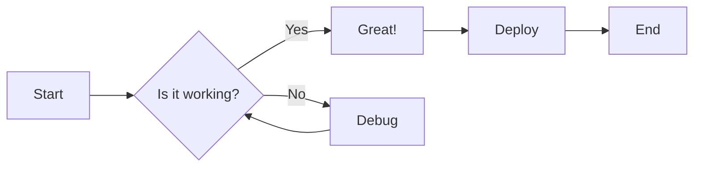
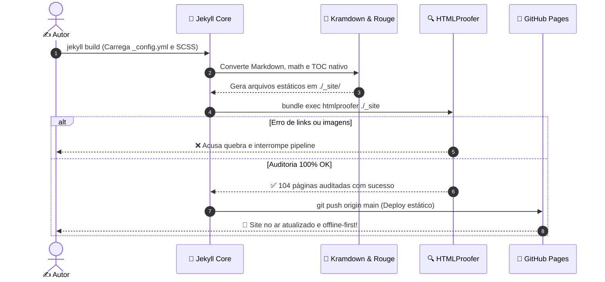

Esta página serve como um **laboratório de testes e validação visual** do nosso design system com Pico CSS, tipografia editorial e paleta de cores.

> [!NOTE]
> **Curiosidade:** Esta postagem na verdade marca o dia 22/03/2024 às 07:19, o exato momento em que saí do hotel de moto para a viagem da mudança definitiva de Curitiba para Uberlândia! Um pouco de história para encher linguiça e nos permitir manter esse arquivo de showcase listado como o primeiríssimo post do blog. 🏍️ 💨

<details class="toc-box" markdown="1" open>
  <summary><strong>📑 Sumário & Índice de Seções (TOC)</strong></summary>

* TOC
{:toc}

</details>

---

## 1. Tipografia & Hierarquia de Títulos

Abaixo vemos a progressão e escala tipográfica padrão de artigos:

# Título de Nível 1 (H1)

> [!TIP]
> **Atenção:** Em artigos normais do blog, **não utilizamos a tag H1 no corpo do texto**, pois o H1 já está reservado semanticamente para o título principal do post (título da página). Ele está incluído aqui apenas para fins de validação visual e testes da escala completa.

Bacon ipsum dolor amet pork loin venison strip steak ground round turducken, picanha boudin capicola t-bone shank prosciutto cow pork tail. Filet mignon pork belly drumstick landjaeger spare ribs.

## Título de Nível 2 (H2)

Bresaola brisket fatback burgdoggen swine, short loin ham hock flank andouille chuck corned beef. Prosciutto tail drumstick, picanha cow pig capicola tri-tip frankfurter ribeye biltong.

### Título de Nível 3 (H3)

Pork chop pastrami doner, salami shankle corned beef fatback bresaola pig short ribs. Chuck pork loin capicola beef ribs tail, venison meatball pancetta turkey ham hock boudin sirloin.

#### Título de Nível 4 (H4)

Short loin cupim salami buffalo fatback, turducken strip steak kevin pancetta filet mignon pig biltong. Shankle andouille porchetta leberkas, boudin venison prosciutto cow spare ribs swine capicola jowl.

##### Título de Nível 5 (H5)

Ham tail corned beef, cupim meatball pork loin pork tri-tip biltong boudin. Bacon flank pastrami ground round, leberkas jowl strip steak pancetta bresaola drumstick pork belly pork chop.

###### Título de Nível 6 (H6)

Parágrafo normal com texto corrido demonstrando o fluxo e ritmo de leitura. Podemos incluir **negrito para ênfase forte**, *itálico para termos estrangeiros ou citações leves*, ~~texto tachado para revisões~~ e `código inline formatado` como `kubectl get pods -n kube-system` ou variáveis como `$theme-dark-cyan`.

Também podemos usar atalhos de teclado com tags KBD: pressione <kbd>Ctrl</kbd> + <kbd>Shift</kbd> + <kbd>P</kbd> ou <kbd>⌘</kbd> + <kbd>K</kbd>.

> "Esta é uma citação em bloco (blockquote) para destacar pensamentos, referências bibliográficas ou reflexões filosóficas no meio de uma narrativa técnica."
> — *Autor da Citação*

## 2. Todos os Tipos de Callouts (GFM Admonitions)

Abaixo estão os 5 formatos suportados nativamente pelo GitHub Flavored Markdown e pelo nosso tema:

> [!NOTE]
> **Nota informativa (Note):** Utilizada para contextualizações secundárias, notas de rodapé visuais ou explicações conceituais extras. Deve usar a cor ciano/azul da paleta.

> [!TIP]
> **Dica prática (Tip):** Recomendações úteis, truques de produtividade, atalhos de terminal ou boas práticas de engenharia. Utiliza o tom verde da paleta.

> [!IMPORTANT]
> **Aviso importante (Important):** Informações cruciais que o leitor não pode pular para obter sucesso no procedimento. Utiliza o tom roxo/violeta da paleta.

> [!WARNING]
> **Alerta de perigo ou atenção (Warning):** Mudanças de comportamento, armadilhas comuns, versões incompatíveis ou riscos moderados. Utiliza o tom laranja/âmbar.

> [!CAUTION]
> **Cuidado crítico (Caution):** Ações destrutivas como exclusão de volumes de dados, comandos irreversíveis com `rm -rf` ou falhas graves de segurança. Utiliza o tom vermelho.

## 3. Realce de Sintaxe de Código (Rouge / Múltiplas Linguagens)

Blocos de código formatados demonstrando as variáveis da paleta e o espaçamento ajustado de `1rem`:

### Ruby (Vagrantfile)
```ruby
# Exemplo de configuração declarativa
Vagrant.configure("2") do |config|
  config.vm.box = "debian/bookworm64"
  config.vm.hostname = "control-plane-01"

  config.vm.provider :libvirt do |v|
    v.memory = 4096
    v.cpus = 2
    v.nested = true
  end

  config.vm.provision "shell", inline: <<-SHELL
    echo "Instalando dependências de container..."
    apt-get update -y && apt-get install -y containerd
  SHELL
end
```

### Shell Script (Bash)
```bash
#!/usr/bin/env bash
set -euo pipefail

CLUSTER_NAME="k8s-local"
echo "Iniciando verificação do cluster: ${CLUSTER_NAME}"

if ! command -v virsh &> /dev/null; then
    echo "[ERRO] Libvirt/virsh não encontrado no PATH!" >&2
    exit 1
fi

# Loop de verificação dos nós
for node in master worker-01 worker-02; do
    virsh domstate "${node}" || true
done
```

### YAML (Kubernetes Deployment)
```yaml
apiVersion: apps/v1
kind: Deployment
metadata:
  name: nginx-gateway
  namespace: ingress-infra
  labels:
    app.kubernetes.io/name: nginx
spec:
  replicas: 3
  selector:
    matchLabels:
      app: nginx
  template:
    metadata:
      labels:
        app: nginx
    spec:
      containers:
      - name: nginx
        image: nginx:1.25-alpine
        ports:
        - containerPort: 80
        resources:
          limits:
            cpu: "250m"
            memory: "128Mi"
```

## 4. Tabelas Comparativas e Formatação de Dados

Tabelas com cabeçalho, alinhamentos e badges:

| Componente | Versão | Função Principal | Status |
| :--- | :---: | :--- | :---: |
| **Linux Kernel** | 6.1 LTS | Base do sistema operacional Debian | `Estável` |
| **KVM / QEMU** | 7.2 | Virtualização de hardware e aceleração nativa | `Ativo` |
| **Libvirt** | 9.0 | Camada de abstração e gerenciamento de VMs | `Ativo` |
| **Cilium CNI** | 1.14 | Roteamento e observabilidade via eBPF | `Planejado` |

## 5. Elementos Expansíveis (Details / Accordion)

Estruturas `<details>` para exercícios, soluções passo a passo ou conteúdos secundários:

<details>
  <summary><strong>🔍 Exercício Prático: Desafio de Rede no Libvirt (Clique para expandir)</strong></summary>
  
  <p>Tente configurar uma rede isolada <code>isolated-net</code> sem encaminhamento NAT. Como ficaria a definição XML?</p>

  <p><strong>Solução:</strong></p>
```xml
<network>
  <name>isolated-net</name>
  <bridge name="virbr2" stp="on" delay="0"/>
  <ip address="192.168.100.1" netmask="255.255.255.0">
    <dhcp>
      <range start="192.168.100.10" end="192.168.100.50"/>
    </dhcp>
  </ip>
</network>
```
</details>

<details open>
  <summary><strong>💡 Observação Técnica Avançada (Aberto por Padrão)</strong></summary>
  
  <p>Quando o atributo <code>open</code> está presente no HTML, o container inicia expandido para leitura imediata, mantendo a opção de recolhimento pelo leitor.</p>
</details>

## 6. Listas e Checklist de Tarefas

- [x] Provisionar a infraestrutura de laboratório com Vagrant e Libvirt
- [x] Configurar as chaves SSH e inventário dinâmico
- [ ] Inicializar o control-plane do Kubernetes com `kubeadm`
- [ ] Instalar CNI com Cilium e habilitar suporte a eBPF
- [ ] Executar benchmark de performance e carga

Lista ordenada com passos numerados:
1. Primeiro passo: clone o repositório oficial do projeto.
2. Segundo passo: configure o arquivo `.env` com suas credenciais.
3. Terceiro passo: execute `make setup` e acompanhe os logs de inicialização.

## 7. Expressões Matemáticas (KaTeX / LaTeX)

Com o suporte ao **KaTeX (servido 100% local e offline)** ativado no blog, podemos renderizar equações matemáticas nativamente de forma ultrarrápida, com tipografia perfeita e suporte aos modos claro e escuro. 

### Equações Inline
A expressão matemática da identidade de Euler é $$e^{i\pi} + 1 = 0$$, e pode ser descrita inline usando a sintaxe `$$ ... $$`. 
Outro exemplo: a fórmula resolutiva da equação do 2º grau é $$x = \frac{-b \pm \sqrt{b^2 - 4ac}}{2a}$$.

### Equações em Bloco
Para expressões mais elaboradas e complexas, usamos a sintaxe `$$ ... $$` no Markdown para criar blocos centralizados:

$$
\mathcal{F}\{f\}(\omega) = \int_{-\infty}^{\infty} f(t) e^{-i\omega t} \, dt
$$

As matrizes e somatórios também são renderizados de maneira impecável:

$$
A_{m,n} = 
\begin{pmatrix}
  a_{1,1} & a_{1,2} & \cdots & a_{1,n} \\
  a_{2,1} & a_{2,2} & \cdots & a_{2,n} \\
  \vdots  & \vdots  & \ddots & \vdots  \\
  a_{m,1} & a_{m,2} & \cdots & a_{m,n} 
\end{pmatrix}
$$

E a famosa equação da Relatividade Geral de Einstein:

$$
R_{\mu \nu} - \frac{1}{2}g_{\mu \nu}R + g_{\mu \nu}\Lambda = \frac{8\pi G}{c^4}T_{\mu \nu}
$$

## 8. Diagramas Técnicos & Fluxogramas (Mermaid.js)

O blog oferece integração nativa com diagramas **Mermaid.js**, renderizados dinamicamente no client-side com suporte a alternância em tempo real entre temas Claro e Escuro, tipografia monoespaçada integrada e contornos personalizados.

### Fluxograma de Decisão (Flowchart)



### Ciclo de Vida do Build Estático (Sequence Diagram)


