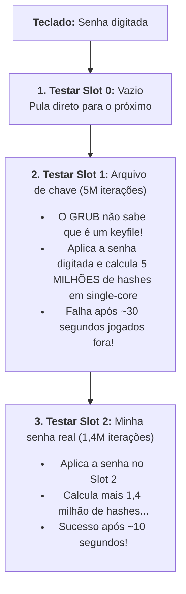

Existe uma sensação física de puro ódio que todo usuário de Linux já experimentou: ligar o notebook, digitar a senha do disco e ficar encarando uma tela preta estática, sem cursor piscando, sem sinal de vida, enquanto os segundos escorrem pelo ralo. No meu notebook, um Dell com SSD NVMe rápido rodando Debian Trixie (o mesmo ambiente que mostrei no ), esse ritual diário estava cobrando um pedágio ridículo de um minuto e quarenta segundos.

Cem segundos. Em pleno 2026, com processador moderno de vários núcleos e SSD em barramento PCIe veloz, o sistema subia com a agilidade de um disquete de três polegadas e meia esquecido na gaveta.

A resposta que você mais ouve por aí em fórum quando reclama disso é aquela conversa mole de quem se conformou com a desgraça: "Ah, mas criptografia de disco cobra seu preço mesmo, segurança dói". Aham, senta lá. Criptografia bem configurada não tem que doer, muito menos fazer você esperar quase dois minutos olhando pro nada todo santo dia. O problema quase nunca é a matemática da cifra; é a montanha de suposições burras e configurações herdadas que a gente deixa passar batido sem auditar.

Cansei de passar raiva e resolvi abrir o capô pra caçar onde cada milissegundo estava sendo jogado no lixo. No caminho, cometi alguns tropeços vergonhosos, me achei o gênio da criptografia pra logo em seguida tomar uma invertida do GRUB, e descobri que metade da lentidão era pura teimosia de software legado.

## O modelo de ameaça: pragmatismo contra a paranoia inútil

Antes de sair alterando partição e quebrando o sistema, vale a pena parar dois minutos e fazer a pergunta que quase todo profissional de TI esquece de se fazer: contra quem diabos eu estou me protegendo?

O meu modelo de ameaça pro notebook é simples, direto e muito pessoal. Eu não tô tentando proteger segredos de estado ou código sigiloso de cliente com multas milionárias em contrato. Eu quero proteger as minhas coisas: meus dados, meus projetos, meus rascunhos, minhas pesquisas e a minha vida digital. Coisas que, mesmo se vazassem, não causariam o fim do mundo pra ninguém, mas que simplesmente não dizem respeito a mais ninguém além de mim. É meu, não é público, e ninguém tem que meter o nariz. Se alguém levar a minha máquina num furto de oportunidade, num assalto no trânsito ou na clássica mochila esquecida no café, o notebook vai estar desligado. Em repouso e sem a chave, o SSD tem que ser um amontoado inútil de bytes aleatórios. Ponto final.

Eu não estou montando uma estação de trabalho para fugir da CIA, do Mossad ou pra reviver tempos de conspirações em canais de IRC com máscara de Guy Fawkes comprada na 25 de Março. Até porque, convenhamos: quem realmente precisa de anonimato agressivo e paranoia de verdade espeta um pendrive com Tails pra rodar tudo na memória RAM sem nem encostar no disco físico, e não fica inventando moda no particionamento do sistema do dia a dia.

Quando você perde a mão no modelo de ameaça, o resultado é pura paranoia operacional:

A primeira loucura é calibrar funções de derivação de chave (o bendito PBKDF2) pra rodar milhões de iterações além da conta. Se 1,4 milhão de rodadas já tornam qualquer ataque de força bruta offline contra uma boa senha humana uma insanidade matemática impraticável, forçar 6 milhões de iterações não te deixa "quatro vezes mais seguro". Só faz você perder a paciência na frente da tela preta toda vez que liga o computador. Segurança que te faz odiar a própria máquina é segurança errada.

A segunda loucura é a lenda urbana de desligar o TRIM em disco criptografado. A teoria purista jura de pé junto que ativar o comando de descarte revela quais blocos do SSD estão vazios, o que em tese deixaria um adversário deduzir quanto espaço livre você tem. Na vida real, desligar o TRIM estrangula a velocidade de escrita do NVMe e desgasta a vida útil física dos chips de memória à toa. Destruir a durabilidade do meu hardware só pro ladrão da mochila não saber se eu tenho 200 GB ou 300 GB livres no disco é o ápice do desvio cognitivo.

Com a cabeça no lugar e a paranoia devidamente podada, hora de ir pro terminal ver o estrago real.

## A anatomia do desastre: o baseline de 100 segundos

Para entender onde a vida estava escorrendo, convoquei a ferramenta oficial de lavar roupa suja do boot no Linux: o utilitário `systemd-analyze` [^1].

Reiniciei a máquina, esperei aquela eternidade habitual até a interface aparecer e rodei:

```bash
systemd-analyze
```
*Comando do systemd para detalhar o tempo gasto em cada camada da inicialização.*

A resposta foi um tapa na cara:

```text
Startup finished in 5.304s (firmware) + 54.912s (loader) + 12.575s (kernel) + 32.525s (userspace) = 1min 40.536s
```

Olha a distribuição dessa vergonha:

1. **`loader: 54.912s`**: Quase um minuto inteiro gasto exclusivamente dentro do GRUB, antes mesmo do kernel Linux ter a chance de fazer qualquer coisa.
2. **`kernel: 12.575s`**: Doze segundos e meio de kernel e *initramfs* em um NVMe. Péssimo.
3. **`userspace: 32.525s`**: Mais de trinta segundos do sistema operacional já com a raiz montada, enquanto serviços sofriam pra terminar de carregar.

A culpa não era de uma coisa só. O sistema inteiro estava conspirando em camadas diferentes pra testar minha sanidade.

## O primeiro tropeço: mapeando o terreno no NVMe

O alvo prioritário era óbvio: os 55 segundos do `loader`. O GRUB estava sofrendo pra ler o container LUKS (*Linux Unified Key Setup*), e a ferramenta mandatória pra inspecionar esses metadados é o `cryptsetup` [^2].

E aqui entra a minha primeira presepada do dia. Na pressa e na arrogância de quem acha que digita mais rápido do que pensa, fui direto no disco cru:

```bash
sudo cryptsetup luksDump /dev/nvme0n1
```
*Tentativa brilhante de ler metadados LUKS no disco inteiro sem particionamento.*

O sistema me devolveu o esperado: `Device /dev/nvme0n1 is not a valid LUKS device`. Não satisfeito, tentei na primeira partição (`/dev/nvme0n1p1`), tomando exatamente o mesmo erro na cara (afinal, a `p1` é a partição EFI em FAT32, gênio).

Tive que abaixar a crista, parar de chutar dispositivo e rodar o bom e velho `lsblk` pra olhar o layout de verdade:

```bash
lsblk -o NAME,FSTYPE,SIZE,MOUNTPOINTS
```
*Listagem de partições, tipos de sistemas de arquivos e pontos de montagem.*

```text
NAME                                          FSTYPE        SIZE MOUNTPOINTS
nvme0n1                                                   476.9G 
├─nvme0n1p1                                   vfat          300M /boot/efi
├─nvme0n1p2                                   crypto_LUKS 442.4G 
│ └─luks-8b6735cb-5416-49c6-ba00-2cba26c51a29 ext4        442.4G /
└─nvme0n1p3                                   crypto_LUKS  34.2G 
  └─luks-17c81b89-3961-4234-86a8-a538e7d19407 swap        34.2G [SWAP]
```

Pronto. O desenho real da casa:

* `/dev/nvme0n1p1`: A partição EFI aberta, em FAT32, onde mora o binário do GRUB.
* `/dev/nvme0n1p2`: O container LUKS1 onde mora a raiz (`/`). O diretório `/boot` fica aqui dentro, o que obriga o GRUB a usar o módulo `cryptodisk` pra conseguir enxergar o kernel e o *initramfs*.
* `/dev/nvme0n1p3`: A swap criptografada, também em LUKS1, pra suportar suspensão em disco.

Com o alvo certo na mira, rodei o `luksDump` na partição raiz:

```bash
sudo cryptsetup luksDump /dev/nvme0n1p2
```
*Inspeção dos cabeçalhos, algoritmos e keyslots da partição raiz.*

E ali estava o monstro em números garrafais:

```text
LUKS header information for /dev/nvme0n1p2
Version:        1
Cipher name:    aes
Cipher mode:    xts-plain64
Hash spec:      sha256
Key Slot 0: ENABLED
	Iterations:         6087522
Key Slot 1: ENABLED
	Iterations:         4969554
```

Na swap (`nvme0n1p3`) era a mesma palhaçada: 6.260.154 iterações no Slot 0 e 5.275.854 no Slot 1.

Seis milhões de iterações de hash. O GRUB estava tentando mastigar seis milhões de rodadas de PBKDF2 toda vez que eu dava boot.

## A lentidão do GRUB: matemática de single-core sem acelerador

Mas por que raios seis milhões de iterações demoram quase um minuto no GRUB se o Linux depois roda tudo liso?

A mecânica é simples: o LUKS1 usa PBKDF2 com SHA-256 pra derivar a Master Key a partir da sua senha. Quando você instala a distro ou cria uma chave, o utilitário `cryptsetup` faz um benchmark na sua CPU. A meta desse teste é medir quantas iterações o processador consegue calcular num alvo de 2.000 milissegundos (dois segundos).

Só tem uma pegadinha: o `cryptsetup` roda no Linux quentinho e confortável. O kernel tem suporte a todos os núcleos da CPU, escalonamento paralelo e instruções vetoriais com aceleração por hardware ativas (AES-NI, AVX2 e afins). Numa CPU moderna voando com AES-NI, fritar seis milhões de hashes consome exatamente dois segundos.

Mas adivinha quem NÃO tem nada disso? Ele mesmo, o GRUB:

| Ambiente | Núcleos de CPU | Aceleração por Hardware | Tempo para 6M Hashes |
| :--- | :--- | :--- | :--- |
| **Kernel Linux** | Multi-core (todos os núcleos) | AES-NI + AVX2 (Hardware) | **~2 segundos** |
| **GRUB Bootloader** | 1 núcleo (Single-core) | Nenhuma (Software puro) | **~50 segundos** |

O GRUB roda no ambiente tosco do firmware UEFI. Ele opera em modo protegido de 64 bits, num único núcleo, sem drivers avançados e sem usar nenhuma instrução de aceleração criptográfica por hardware, uma limitação notória e amplamente documentada no ecossistema do bootloader [^3]. O que o kernel mastiga em dois segundos vira um calvário de cinquenta segundos de pura tortura matemática no bootloader.

O GRUB não é burro por maldade; ele foi feito pra ser portátil e subir em qualquer lata velha. O erro foi o instalador calibrar a chave achando que o GRUB teria o mesmo poder de fogo do kernel.

## A armadilha do Slot 2: quando a emenda sai pior que o soneto

Com a causa identificada, me senti o mestre da engenharia de sistemas. Pensei: "Moleza. É só criar um keyslot novo calibrado pra 500 ms, derrubar as iterações e matar o slot velho".

Mãos à obra:

1. Adicionei a senha no **Slot 2** com `--iter-time 500`:
   `cryptsetup luksAddKey /dev/nvme0n1p2 --iter-time 500 -S 2`
   As iterações caíram pra ~1.460.000 (uma redução brutal de 76% na carga).
2. Deletei o antigo **Slot 0** que tinha os 6 milhões de iterações:
   `cryptsetup luksKillSlot /dev/nvme0n1p2 0`
3. Fiz a mesma mágica na swap (`nvme0n1p3`).

Reiniciei o notebook com aquele sorrisinho de canto de boca de quem acabou de resolver o problema do século.

Digito a senha no GRUB. Tela preta. Espero. Espero mais um pouco. E mais um pouco.

O sistema finalmente subiu. Rodei o `systemd-analyze` com o coração acelerado e dei de cara com isso: tempo de `loader` cravado em **42.810 segundos**.

De 54.9s pra 42.8s. Uma queda ridícula de 12 segundos.

Eu cortei mais de quatro milhões de iterações e ganhei míseros doze segundos? A sensação de palhaço foi instantânea. O que diabos estava acontecendo?

Foi aí que tomei a rasteira mais genial da arquitetura do GRUB: **ele testa os keyslots em ordem estritamente linear (0 -> 1 -> 2 -> ... -> 7)**.

Pensa comigo no que eu acabei de fazer. Eu apaguei o Slot 0 e botei minha senha no Slot 2. Mas o Slot 1 continuava existindo, e nele morava o arquivo `/crypto_keyfile.bin`, que o *initramfs* usa pra montar o disco sem me pedir senha duas vezes. E esse arquivo no Slot 1 tinha sido criado na instalação com **cinco milhões de iterações**.

Quando eu digitava minha senha no GRUB, o coitado do bootloader fazia exatamente isso:



O GRUB pegava a senha humana do teclado, jogava no Slot 1 (que era um keyfile binário), calculava cinco milhões de hashes até perceber que não batia, descartava com erro e só aí ia pro Slot 2 calcular mais 1,4 milhão!

Eu fiz o sistema pagar o pedágio cumulativo de **6,4 milhões de computações**. Meu atalho "esperto" quase piorou o problema.

> [!WARNING] Cuidado com a ordem dos keyslots
> O GRUB não faz adivinhação nem paralelismo. Se você deixar slots pesados antes da sua senha humana, o bootloader vai mastigar cada um deles até falhar antes de tentar o slot certo.

## A virada no bootloader: botando a senha humana no Slot 0

Depois do choque de humildade, a lição ficou clara: a senha humana tem que ficar obrigatoriamente no **Slot 0**. O GRUB precisa bater no primeiro slot, achar a senha de cara e nem olhar pros outros.

Pra fazer isso sem tomar erro interativo de senha no terminal, usei o próprio arquivo de chave do sistema (`/crypto_keyfile.bin`) pra autorizar a operação:

```bash
sudo cryptsetup luksAddKey /dev/nvme0n1p2 --key-file /crypto_keyfile.bin --iter-time 500 -S 0
sudo cryptsetup luksAddKey /dev/nvme0n1p3 --key-file /crypto_keyfile.bin --iter-time 500 -S 0
```
*Criando a senha no Slot 0 com 500ms de calibração autorizada pelo keyfile.*

Em seguida, mandei o Slot 2 pro espaço pra limpar a bagunça:

```bash
sudo cryptsetup luksKillSlot /dev/nvme0n1p2 2 --key-file /crypto_keyfile.bin
sudo cryptsetup luksKillSlot /dev/nvme0n1p3 2 --key-file /crypto_keyfile.bin
```
*Excluindo o Slot 2 redundante pra deixar a tabela nos trinques.*

Reboot na máquina.

Prompt do GRUB. Digito a senha. Enter. Duas piscadas de cursor, menos de dez segundos e a lista do kernel pulou na tela.

Rodei o `systemd-analyze`: o tempo de `loader` desabou de **54.912s** para **18.792 segundos**.

Considerando que 5 segundos são o tempo de menu do GRUB (`GRUB_TIMEOUT=5`) e uns 3 segundos foram minha lentidão humana pra digitar, o tempo real de descriptografia despencou de quase 50 segundos para menos de 10s. Uma redução de mais de 63% apenas respeitando a ordem da fila e parando de fritar a CPU com iterações desnecessárias.

## O pipeline do NVMe: adeus workqueues e TRIM liberado

Resolvido o bootloader, olhei pro segundo culpado: os **12.575 segundos de kernel**.

Em um NVMe rápido, doze segundos é tempo demais pro kernel acordar e montar o sistema de arquivos.

Fui fuçar o módulo `dm-crypt` e encontrei uma relíquia dos tempos dos dinossauros. Por padrão histórico desenhado pra discos rígidos mecânicos, o `dm-crypt` joga todas as operações de leitura e escrita em filas de trabalho assíncronas do kernel (`kworkers`).

Em 2005 isso era ótimo: o processador processava os blocos enquanto o braço mecânico do HD de 5400 RPM viajava lentamente até o setor. Só que num NVMe contemporâneo rodando em barramento PCIe com canais paralelos, o custo de ficar trocando de contexto de CPU entre *threads* do kernel gera mais lentidão do que a própria cifra criptográfica. Despachar leituras e escritas para *workqueues* de software em um SSD moderno é um contrassenso, e a solução recomendada pelo próprio kernel para dispositivos rápidos é contornar essas filas [^4].

A solução prática é mandar o `dm-crypt` processar o I/O direto, de forma síncrona na mesma thread que pediu a operação.

Editei o `/etc/crypttab` [^5] e enfiei as flags `no-read-workqueue,no-write-workqueue` em ambas as partições, sem esquecer da flag `discard` pro TRIM:

```text
luks-8b6735cb-5416-49c6-ba00-2cba26c51a29 UUID=8b6735cb-5416-49c6-ba00-2cba26c51a29 /crypto_keyfile.bin luks,discard,no-read-workqueue,no-write-workqueue,keyscript=/bin/cat
luks-17c81b89-3961-4234-86a8-a538e7d19407 UUID=17c81b89-3961-4234-86a8-a538e7d19407 /crypto_keyfile.bin luks,discard,no-read-workqueue,no-write-workqueue,keyscript=/bin/cat
```

Como isso tem que ir pro *initramfs*, atualizei as imagens de boot:

```bash
sudo update-initramfs -u -k all
```
*Regenerando o initramfs pra carregar as flags de trabalho síncrono no boot.*

Resultado: o tempo de kernel caiu de **12.575s para 8.716s**. Quatro segundos a menos sem mexer em nada de código, só tirando intermediários do caminho do hardware.

E pra tirar a dúvida sobre o TRIM, dei o disparo manual pra ver se o descarte passava pelo container criptografado:

```bash
sudo fstrim -av
```
*Disparando o TRIM manual em todos os pontos de montagem.*

A resposta foi linda:

```text
/boot/efi: 504.9 MiB (529457152 bytes) trimmed on /dev/nvme0n1p1
/: 412.7 GiB (443147571200 bytes) trimmed on /dev/mapper/luks-8b6735cb-5416-49c6-ba00-2cba26c51a29
```

Mais de 410 GB de blocos descartados direto no controlador NVMe através da camada do LUKS. Sem perda de integridade e sem matar o SSD de estresse.

## A faxina dos 34 GB de swap: zram na memória e adeus hibernação

Com o I/O do NVMe destravado e o bootloader nos trinques, bati o olho na tabela de partições e me deparei com outro dinossauro herdado da instalação padrão: a partição `/dev/nvme0n1p3`.

Eram **34,2 GB** de SSD dedicados exclusivamente para swap criptografado em LUKS1.

Para contextualizar: esse notebook tem 32 GB de memória RAM física. Num SSD de 512 GB, reservar quase 35 gigabytes brutos pra uma área de troca que mal passava de alguns míseros megabytes usados no dia a dia é puro desperdício de espaço.

E o estrago não era só em disco:

1. **Sobrecarga de boot:** o swap criptografado exigia seu próprio mapeamento no `dm-crypt`, a linha do kernel carregava obrigatoriamente a flag `resume=/dev/mapper/luks-17c81b89...`, e o *initramfs* perdia tempo precioso inicializando o subsistema de resume e escaneando o container antes de passar a bola pro `systemd`.
2. **Desgaste de silício (*write amplification*):** ficar paginando blocos em células flash NAND gasta ciclos úteis de escrita do SSD sem nenhuma necessidade prática numa máquina com memória de sobra.

"Mas Dudu, por que diabos o instalador criou 34 GB de swap?"

Por causa de uma única funcionalidade: **hibernação profunda em disco** (`systemctl hibernate`). Para conseguir descarregar 32 GB de RAM no SSD e desligar a máquina, você precisa de uma partição de swap pelo menos do tamanho da memória física.

Acontece que eu **nunca** uso hibernação profunda. Meu padrão de uso em notebook de colo é simplesmente fechar a tampa, deixar o sistema em Suspensão na RAM (*sleep*) e reabrir segundos depois. Manter 34 GB de swap no NVMe era pura inércia de instalação padrão.

### Por que não desativar o swap por completo?

A reação impulsiva de quem tem 32 GB de RAM é mandar um `sudo swapoff -a` definitivo e viver feliz sem swap nenhum. Não faça isso.

O subsistema de gerenciamento de memória do kernel Linux (`mm`) foi desenhado contando com a existência de uma área de troca. O kernel usa o swap pra desovar páginas anônimas frias: pequenos blocos de memória alocados por processos e daemons de background que rodaram na inicialização e nunca mais vão ser executados. Quando o Linux consegue empurrar esse lixo inativo pro swap, ele libera memória RAM física nobre para o *page cache* (o cache de disco em memória), o que deixa o sistema globalmente muito mais ágil nas leituras de arquivos.

Além disso, sem swap nenhum, qualquer pico repentino de consumo ou vazamento de memória dispara o temido `OOM Killer` (*Out Of Memory Killer*) de forma abrupta, matando seu navegador ou sua IDE no meio do expediente sem dó nem piedade.

A saída de engenharia ideal é usar o **zram** [^6].

O `zram` cria um dispositivo de bloco comprimido diretamente na memória RAM usando algoritmos velocíssimos como `zstd`. Ele intercepta as páginas frias e as comprime em tempo real na proporção de 2:1 a 3:1. Como tudo roda no barramento da memória DDR, a latência é medida em nanossegundos (infinitamente mais rápida do que qualquer NVMe PCIe), com zero I/O no disco físico e alocando memória estritamente sob demanda.

> [!TIP] Bônus de Privacidade e Segurança
> Trocar swap em disco por zram é muito mais seguro para a privacidade dos dados: páginas de memória jogadas em um swap físico ficam gravadas em células flash do SSD até serem sobrescritas. No zram, a área de troca reside 100% na memória RAM volátil. Desligou o computador, tudo evapora no mesmo microssegundo sem deixar rastro de silício.

### A execução e as duas rasteiras do initramfs

A teoria era linda. A prática, claro, me reservou duas armadilhas clássicas do ecossistema Debian.

Primeiro, desativei o swap ativo e limpei as tabelas:

```bash
sudo swapoff -a
```
*Desativação imediata da paginação no sistema rodando.*

Em seguida, limpei o `/etc/fstab` (removendo a linha do swap) e o `/etc/crypttab` (removendo a entrada do `luks-17c81b89...`). No `/etc/default/grub`, limpei a linha `GRUB_CMDLINE_LINUX_DEFAULT` arrancando o parâmetro `resume=/dev/mapper/luks-17c81b89...`.

E aí veio a **primeira armadilha**: ao rodar `sudo update-initramfs -u -k all`, tomei o seguinte aviso na cara:

```text
cryptsetup: WARNING: target 'luks-17c81b89-3961-4234-86a8-a538e7d19407' not found in /etc/crypttab
```

O hook de geração do *initramfs* (`/usr/share/initramfs-tools/hooks/cryptroot`) continuava farejando intenção residual de hibernação. A solução foi desativar explicitamente o suporte a resume nos arquivos de configuração do initramfs:

```bash
echo "RESUME=none" | sudo tee /etc/initramfs-tools/conf.d/resume
```
*Configurando explicitamente RESUME=none para calar o hook de hibernação.*

Também configurei `RESUME=none` em `/etc/initramfs-tools/initramfs.conf`.

Mas a **segunda armadilha** foi ainda mais traiçoeira. Fechei o container criptografado no Device Mapper com `sudo cryptsetup close luks-17c81b89-3961-4234-86a8-a538e7d19407` e tentei regerar o *initramfs*. O aviso subiu de tom e virou erro fatal que abortou o processo:

```text
cryptsetup: ERROR: Couldn't resolve device /dev/mapper/luks-17c81b89-3961-4234-86a8-a538e7d19407
```

O `/etc/crypttab` estava limpo. O `/etc/fstab` estava limpo. O `RESUME=none` estava configurado. De onde diabos o script estava tirando aquele UUID se ele não existia mais em lugar nenhum?

Aqui está um dos comportamentos mais obscuros do Debian que costuma enlouquecer administradores de sistema: **o script de hook do initramfs lê a linha de comando do kernel da sessão viva em execução (`/proc/cmdline`)**.

Como a máquina ainda não havia sido reiniciada, o kernel carregado na memória continuava expondo a instrução `resume=/dev/mapper/luks-17c8...`. Ao ver a instrução na sessão ativa e notar que o dispositivo de bloco correspondente estava fechado no `dm-crypt`, o script abortava a compilação achando que o sistema ficaria inoperante.

A saída estratégica foi um drible técnico: reabri temporariamente o container com a chave para satisfazer o script birrento durante a compilação:

```bash
sudo cryptsetup open /dev/nvme0n1p3 luks-17c81b89-3961-4234-86a8-a538e7d19407 --key-file /crypto_keyfile.bin
sudo update-initramfs -u -k all
sudo update-grub
```
*Reabertura temporária do container para permitir a compilação da imagem sem erros.*

Com a nova imagem gerada e o GRUB atualizado sem a flag de resume, reiniciei o computador. Ao subir, o kernel finalmente expurgou a linha do `/proc/cmdline`.

### Subindo o zram

Com o sistema reiniciado e o swap legado em disco devidamente exorcizado, instalei o pacote nativo do utilitário:

```bash
sudo apt update && sudo apt install zram-tools -y
```
*Instalação do utilitário de gerenciamento automático de zram no Debian.*

O serviço `zramswap.service` provisionou instantaneamente o bloco virtual comprimido com prioridade máxima:

```bash
swapon --show
```
*Conferência da paginação ativa no sistema operacional.*

```text
NAME       TYPE      SIZE USED PRIO
/dev/zram0 partition 15,5G   0B  100
```

Metade da memória RAM física (15,5 GB) transformada em swap ultrarrápido com compressão `zstd`, sem tocar no SSD.

> [!NOTE] O zram não "sequestrou" metade da sua memória RAM
> Ver 15,5 GB listados no `swapon` assusta à primeira vista, mas o zram trabalha com alocação estritamente dinâmica (*thin provisioning*). Ele não pré-aloca nem "come" essa memória na inicialização. Repare no `USED 0B` na tabela: enquanto o swap estiver desocupado, o consumo real na RAM física é zero. Somente quando o kernel envia páginas inativas é que o bloco aloca memória e comprime os dados em tempo real via `zstd` (numa proporção típica de 2:1 a 3:1). Os 15,5 GB são apenas o teto virtual máximo aceito, e não memória confiscada. Para auditar no detalhe quanto espaço físico comprimido ele está consumindo a qualquer momento, use o comando `zramctl`.

O ganho no boot foi imediato: sem precisar inicializar subsistema de resume nem escanear partição de swap no dm-crypt, o tempo de **kernel despencou de 8.716s para 5.957s**. Quase três segundos de economia direta arrancados só nessa faxina.

### Reivindicando os 34 GB: expansão do LUKS e ext4 a quente

Com o swap rodando liso na memória, sobrou um elefante na sala: os **34,2 GB** da partição `/dev/nvme0n1p3` mofando no disco como espaço morto. Eu não comprei SSD NVMe pra deixar mais de trinta gigas encostados sem uso. Se o swap físico morreu, aquele espaço pertencia por direito à partição raiz (`/`).

A beleza da arquitetura de armazenamento do Linux moderno é que você não precisa dar boot por Live USB nem desmontar partição nenhuma pra fazer essa expansão. Dá pra redimensionar tudo com o sistema montado e rodando a quente.

Primeiro, instalei as ferramentas de particionamento e invoquei o `parted` no disco físico:

```bash
sudo apt update && sudo apt install cloud-guest-utils parted -y
sudo parted /dev/nvme0n1
```
*Instalação de utilitários de disco e abertura do particionador interativo.*

Dentro do `parted`, consultei a tabela GPT, deletei a finada partição 3 e estiquei a partição 2 até o limite físico do disco:

```text
(parted) print
Model: SM2P41C3 NVMe ADATA 512GB (nvme)
Disk /dev/nvme0n1: 512GB
Sector size (logical/physical): 512B/512B
Partition Table: gpt

Number  Start   End    Size    File system  Name  Flags
 1      2097kB  317MB  315MB   fat32              boot, esp
 2      317MB   475GB  475GB                root
 3      475GB   512GB  36,7GB

(parted) rm 3
(parted) resizepart 2 100%
(parted) quit
```

A partição `/dev/nvme0n1p2` agora ocupava o restante inteiro do NVMe (476,6 GB úteis). Mas o container criptográfico e o sistema de arquivos continuavam enxergando apenas os 442 GB antigos.

Para avisar o subsistema de criptografia e o `ext4` que o espaço havia crescido, foram dois comandos diretos com o sistema de arquivos montado:

```bash
sudo cryptsetup resize luks-8b6735cb-5416-49c6-ba00-2cba26c51a29
sudo resize2fs /dev/mapper/luks-8b6735cb-5416-49c6-ba00-2cba26c51a29
```
*Redimensionamento dinâmico do container LUKS e expansão online do sistema de arquivos ext4.*

O `resize2fs` incorporou os novos blocos na mesma hora, sem pestanejar:

```text
resize2fs 1.47.2 (1-Jan-2025)
Filesystem at /dev/mapper/luks-8b6735cb... is mounted on /; on-line resizing required
old_desc_blocks = 56, new_desc_blocks = 60
The filesystem on /dev/mapper/luks-8b6735cb... is now 124949073 (4k) blocks long.
```

O `lsblk` confirmou o mapa final completamente limpo:

```bash
lsblk
```
*Conferência da topologia final de dispositivos de bloco.*

```text
NAME                                          MAJ:MIN RM   SIZE RO TYPE  MOUNTPOINTS
zram0                                         252:0    0  15,5G  0 disk  [SWAP]
nvme0n1                                       259:0    0 476,9G  0 disk  
├─nvme0n1p1                                   259:1    0   300M  0 part  /boot/efi
└─nvme0n1p2                                   259:2    0 476,6G  0 part  
  └─luks-8b6735cb-5416-49c6-ba00-2cba26c51a29 253:0    0 476,6G  0 crypt /
```

E o `df -h /` exibiu os 469 GB de espaço total com 423 GB livres na partição raiz.

Para coroar a faxina e garantir que os 34 GB recém-liberados não ficassem acumulando blocos velhos no controlador flash, mandei um TRIM geral pelo sistema:

```bash
sudo fstrim -av
```
*Execução do descarte de blocos (TRIM) em todo o armazenamento.*

```text
/boot/efi: 292,3 MiB descartado em /dev/nvme0n1p1
/: 446,4 GiB descartado em /dev/mapper/luks-8b6735cb-5416-49c6-ba00-2cba26c51a29
```

Quase 450 GiB descartados de ponta a ponta através do container LUKS. A flag `discard` que configuramos no `/etc/crypttab` funcionando como manda o manual.

### Tirando a prova real: saúde física e taxa de transferência bruta

Com as partições arrumadas, o swap na RAM e as flags de trabalho síncrono ativas, resolvi tirar a teima de duas lendas urbanas que sempre pipocam em discussão de hardware: a de que SSDs com TRIM ativo e criptografia se desgastam rápido demais, e a de que o Linux perde desempenho brutal de I/O em discos com LUKS.

Instalei o `nvme-cli` e fui consultar a telemetria SMART diretamente do controlador ADATA de 512 GB:

```bash
sudo apt install nvme-cli -y
sudo nvme smart-log /dev/nvme0n1
```
*Inspeção dos registros SMART de desgaste e temperatura do NVMe.*

O relatório cuspiu a realidade em números crus:

```text
Smart Log for NVME device:nvme0n1 namespace-id:ffffffff
critical_warning                    : 0
temperature                         : 21 °C (294 K)
available_spare                     : 100%
percentage_used                     : 12%
Data Units Read                     : 41408266 (21.20 TB)
Data Units Written                  : 41533670 (21.27 TB)
power_on_hours                      : 14255
unsafe_shutdowns                    : 326
media_errors                        : 0
```

Mais de 14.200 horas de uso (quase dois anos de tempo ligado acumulado), mais de 21 Terabytes gravados e apenas 12% de vida útil consumida. Cem por cento de blocos sobressalentes intactos, zero erros de mídia e operando a 21 °C. A lenda de que o TRIM estraga o drive cai por terra aqui mesmo.

E sobre a taxa de leitura através da camada criptográfica? Instalei o `hdparm` e rodei um benchmark de leitura bufferizada direto no dispositivo descriptografado `/dev/mapper/luks-8b67...`:

```bash
sudo apt install hdparm -y
sudo hdparm -Tt /dev/mapper/luks-8b6735cb-5416-49c6-ba00-2cba26c51a29
```
*Medição de taxa de leitura em cache de memória e leitura contínua de disco.*

```text
Timing cached reads:   43864 MB in  2.00 seconds = 21983.83 MB/sec
Timing buffered disk reads: 5584 MB in  3.00 seconds = 1860.90 MB/sec
```

1.860 MB por segundo. E pra não deixar dúvida sobre truque de cache, fiz um despejo sequencial de 4 Gigabytes via `dd` direto pro limbo (`/dev/null`):

```bash
sudo dd if=/dev/mapper/luks-8b6735cb-5416-49c6-ba00-2cba26c51a29 of=/dev/null bs=1M count=4096 status=progress
```
*Teste de leitura bruta sequencial de 4 GB através do dispositivo criptografado.*

```text
4294967296 bytes (4,3 GB, 4,0 GiB) copiados, 2,28909 s, 1,9 GB/s
```

Quatro gigabytes lidos e descriptografados pelo kernel em dois segundos e fração: **1,9 GB/s** cravados na tela.

Essa é a velocidade real da cifra quando você elimina as filas intermediárias de *kworkers* com `no-read-workqueue,no-write-workqueue` e deixa as instruções AES-NI da CPU trabalharem em conjunto com o barramento PCIe. Criptografia no Linux não é lenta; lento é o amontoado de *defaults* de vinte anos atrás que a gente deixa no piloto automático pra depois reclamar que "segurança cobra seu preço".

## O purgatório do userspace: Plymouth, GNOME Keyring e o Wi-Fi

Faltava a última trincheira: os mais de trinta segundos do **userspace (32.525s)**.

Rodei a cadeia crítica pra ver quem estava segurando a fila:

```bash
systemd-analyze critical-chain
```
*Mapeando os serviços que estavam travando a inicialização do userspace.*

Três aberrações saltaram aos olhos.

A primeira e mais vergonhosa: o `plymouth-quit-wait.service` consumindo inacreditáveis **21 segundos**.

Vinte e um segundos pra encerrar uma tela de splash! Em computadores com autologin no GDM e `/boot` criptografado no GRUB, o Plymouth se recusa a largar o *framebuffer* enquanto o Wayland e o driver KMS tentam assumir a tela direta. Fica um puxando o cobertor do outro até o serviço atingir o timeout.

Como animaçãozinha de carregamento não me serve de nada numa máquina que eu uso pra produzir, arranquei fora sem dó:

1. Tirei o parâmetro `splash` de `/etc/default/grub` e rodei `sudo update-grub`.
2. Mascarei o serviço pra ele nunca mais levantar:
   `sudo systemctl mask plymouth-quit-wait.service`

O segundo vilão era o `NetworkManager-wait-online.service`, comendo **3.5 segundos** de boot.

Ele existe pra segurar o alvo de rede até a placa Wi-Fi pegar IP no DHCP. E por tabela, o Docker ficava esperando a rede subir pra inicializar. Em um notebook de colo que vive trocando de rede sem fio, pausar a inicialização do sistema pra esperar o Wi-Fi sincronizar é piada. Desativei o serviço e deixei a rede se resolver em segundo plano:

```bash
sudo systemctl disable NetworkManager-wait-online.service
```
*Desativando a retenção desnecessária do boot pelo NetworkManager.*

E por fim, aquele clássico mistério pós-login: o desktop do GNOME aparecia na tela e congelava de dois a cinco segundos. Barra superior inerte, dock paralisado, cliques ignorados. Você já começa xingando o Wayland, as extensões ou o motor gráfico.

Fui conferir o diário do sistema:

```bash
journalctl -b -g "pam|keyring"
```
*Buscando registros de falha nos módulos de autenticação e chaveiro.*

E os logs entregaram o culpado:

```text
gdm-autologin][1324]: gkr-pam: no password is available for user
gdm-autologin][1324]: gkr-pam: couldn't unlock the login keyring.
```

A culpa não era do Wayland; a culpa era minha. O comportamento é amplamente documentado na integração entre display managers e PAM [^7]: quando você ativa autologin sem digitar senha no GDM, o PAM não tem senha nenhuma pra repassar pro chaveiro (`gnome-keyring-daemon`). O chaveiro do usuário fica trancado.

Para o meu modelo de ameaça (a máquina desligada na mochila em caso de furto físico), o autologin faz todo o sentido: se a máquina ligou e a senha do LUKS foi digitada com sucesso, eu já estou fisicamente no controle do teclado, e pedir senha de novo no desktop seria só atrito inútil. O problema é que o ecossistema do GNOME cobra o preço desse atalho: aplicativos de background tentam consultar credenciais salvas via D-Bus síncrono. Como o chaveiro está bloqueado, as chamadas bloqueiam a thread principal da interface até dar timeout ou abrir prompt de senha. Saber disso evita gastar horas caçando fantasmas de renderização gráfica.

## O placar final: de 100 para 34 segundos

Depois de caçar cada uma dessas picuinhas, dei o reboot definitivo pra medir o resultado final com boot frio.

A diferença no uso diário é brutal. A máquina liga, eu digito a senha do disco e em instantes o desktop já está pronto pra usar, sem engasgo e sem enrolação.

O comparativo de ponta a ponta:

| Camada do Sistema | Baseline Inicial | Pós-Keyslot (Slot 0) | Pós-Userspace | Pós-zram (Final) | Redução Total |
| :--- | :--- | :--- | :--- | :--- | :--- |
| **Firmware (UEFI)** | 6.969s | 5.308s | 5.298s | 5.317s | -1.652s (-24%) |
| **Loader (GRUB + LUKS)** | 48.464s | 18.792s | 18.011s | 19.049s | **-29.415s (-61%)** |
| **Kernel** | 12.575s | 8.873s | 8.716s | **5.957s** | **-6.618s (-53%)** |
| **Userspace** | 32.525s | 27.234s | 4.146s | **4.279s** | **-28.246s (-87%)** |
| **Tempo Total** | **1min 40.536s** | **1min 00.209s** | **36.172s** | **34.604s** | **-65.932s (-65%)** |

Lembrando que desses 19 segundos do loader final, 5 segundos são timeout fixo de menu do GRUB e cerca de 3 a 4 segundos são o tempo de reação dos meus dedos digitando a senha. A descriptografia pura em si caiu de quase 50 segundos para menos de 10 segundos.

E o userspace, que antes se arrastava por mais de meio minuto com o Plymouth travando tudo, agora entrega a sessão gráfica em pouco mais de 4 segundos:

```text
graphical.target @4.278s
└─power-profiles-daemon.service @4.196s +82ms
  └─multi-user.target @4.194s
    └─docker.service @3.021s +1.172s
      └─containerd.service @2.835s +184ms
        └─network.target @2.831s
          └─NetworkManager.service @2.282s +548ms
            └─network-pre.target @2.279s
              └─ufw.service @1.665s +610ms
                └─local-fs.target @1.649s
                  └─run-user-1000-gvfs.mount @3.680s
                    └─run-user-1000.mount @3.079s
                      └─local-fs-pre.target @644ms
                        └─lvm2-monitor.service @547ms +96ms
                          └─systemd-journald.socket @537ms
                            └─-.mount @482ms
                              └─-.slice @482ms
```

Uma economia líquida de mais de um minuto a cada inicialização da máquina, cravando o boot frio completo com Full Disk Encryption em 34 segundos.

## Lições de engenharia pra não esquecer

Depois dessa maratona de diagnósticos e tropeços, algumas verdades ficam gravadas:

Primeiro: **defina o seu modelo de ameaça antes de bancar o paranoico**. Aumentar parâmetros criptográficos a ponto de tornar o boot intragável não te dá segurança de ponta; só te dá raiva. Segurança de verdade é pragmática e cabe na sua rotina.

Segundo: **o bootloader não é o seu sistema operacional**. O GRUB roda em modo protegido básico, em single-core e sem aceleração por hardware. Calibrar derivação de chave no Linux com AES-NI e achar que o GRUB vai aguentar o tranco é pedir pra passar vergonha.

Terceiro: **keyslot de bootloader é fila de banco**. O GRUB testa os slots de forma puramente sequencial. Se você deixar chaves pesadas antes da senha humana, vai pagar a conta de falha de cada uma delas antes de conseguir logar. Senha interativa mora no Slot 0.

Quarto: **autologin tem pegadinha oculta**. Pular o login com senha quebra o repasse do PAM pro GNOME Keyring, transferindo a dor de autenticação pra chamadas travadas no D-Bus bem no meio da inicialização do desktop.

Quinto: **hardware moderno pede caminho direto**. Filas assíncronas de software no `dm-crypt` foram feitas pra discos rotacionais do início dos anos 2000. Desativar workqueues no NVMe e garantir o TRIM ativo é obrigação pra quem quer a latência real do PCIe.

Por fim: **swap em disco para quem tem RAM de sobra é puro desperdício**. Se você não usa hibernação profunda, manter dezenas de gigabytes de swap criptografado no NVMe só adiciona overhead no bootloader, atraso no kernel e desgaste desnecessário dos chips de memória. O `zram` entrega a flexibilidade que o subsistema de memória precisa com latência de nanossegundos e zero I/O de disco.

Agora o notebook finalmente se comporta como um computador moderno: seguro quando desligado, rápido quando ligado, e sem me fazer perder um minuto de vida olhando pra tela preta.

## Referências

[^1]: **systemd-analyze(1) - Analyze and debug system boot-up performance** {*Debian Manpages*} ([Link](https://manpages.debian.org/trixie/systemd/systemd-analyze.1.en.html))
[^2]: **cryptsetup(8) - Linux man page** {*Debian Manpages*} ([Link](https://manpages.debian.org/trixie/cryptsetup-bin/cryptsetup.8.en.html))
[^3]: **GRUB - LUKS2 and Cryptomount Limitations** {*ArchWiki Documentation*} ([Link](https://wiki.archlinux.org/title/GRUB#LUKS2))
[^4]: **Device-mapper crypto target (dm-crypt)** {*Linux Kernel Documentation*} ([Link](https://docs.kernel.org/admin-guide/device-mapper/dm-crypt.html))
[^5]: **crypttab(5) - Static information about encrypted block devices** {*Debian Manpages*} ([Link](https://manpages.debian.org/trixie/cryptsetup/crypttab.5.en.html))
[^6]: **zram: Compressed RAM based block devices** {*Linux Kernel Documentation*} ([Link](https://docs.kernel.org/admin-guide/blockdev/zram.html))
[^7]: **GNOME Keyring: PAM step** {*ArchWiki Documentation*} ([Link](https://wiki.archlinux.org/title/GNOME/Keyring#PAM_step))
